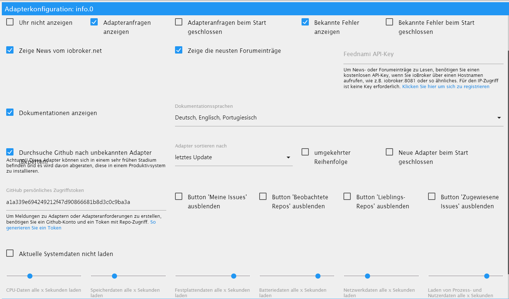

# Admin

Der Info Adapter wurde entwickelt um verschiedene Informationen zum System, über ioBroker und relevante Themen dem User zur Verfügung zu stellen. Der Anwender soll eine Übersicht aller Interessanten und wichtigen Daten erhalten und das ioBroker-Team wird die Möglichkeit gegeben, dem User noch schneller zu kontaktieren, falls wichtige Infos vorhanden sind.

# Installation


Um das Info Fenster im Tab-Reiter zu sehen, müssen Sie nach der Installation es zuerst im Admin als Sichtbar anhaken. Dazu klicken Sie in der Admin-Fenster oben Links auf dem nach unten zeigenden Dreieck und wählen im Menü "Info" aus.


# Konfiguration

<p align="center">
    
</p>

* **Uhr nicht anzeigen** - Um die Uhr oben Links auszublenden.
* **Adapteranfragen anzeigen** - Zeigt den Panel mit den Adapteranfragen an.
    * **Adapteranfragen beim Start geschlossen** - Das Panel mit der Adapteranfragen, ist beim Start des Info Fensters geschlossen.
* **Bekannte Fehler anzeigen** - Zeigt den Panel mit bekannten Fehler und Wünsche für installierte Adaptern an.
    * **Bekannte Fehler beim Start geschlossen** - Das Panel mit der bekannten Fehlern, ist beim Start des Info Fensters geschlossen.

* **Zeige News vom iobroker.net** - Zeigt den Panel mit den offiziellen ioBroker Nachrichten an. 
* **Zeige die neusten Forumeinträge** - Zeigt den Panel mit den letzten Forumeinträge an.
* **Feednami API-Key** - Wenn Sie ioBroker über einen Hostnamen aufrufen, wie z.B. iobroker:8081 oder so ähnliches, müssen Sie sich kostenlos bei Feednami anmelden, um eine entsprechende API Key zu bekommen. Für den Zugriff über eine IP-Adresse ist das nicht nötig.

* **Dokumentationen anzeigen** - Zeigt den Button für die Dokumentationen an.
    * **Wählen Sie die gewünschten Sprachen für die Dokumentationen aus** - Auswahl der Sprachen die bei den Dokumentationen berücksichtigt werden sollen.

* **Durchsuche Github nach unbekannten Adapter (Experten)** - Zeigt den Panel mit der Suche nach nicht offiziell freigegebenen Adaptern im Github.
    * **Adapter sortieren nach** - Sortiert das Ergebnis der Suche nach Name, Erstellungsdatum oder letztes Update.
    * **umgekehrter Reihenfolge** - Kehrt die Reihenfolge der Ergebnisse um.
    * **Neue Adapter beim Start geschlossen** - Das Panel mit den unbekannten Adapter, ist beim Start des Info Fensters geschlossen.

* **Aktuelle Systemdaten nicht laden** - Die aktuellen Daten zum System werden nicht zyklisch geladen.
    * **CPU-Daten alle x Sekunden laden** - Die CPU Daten werden zyklisch alle 2 bis 10 Sekunden geladen. 0 ist aus.
    * **Speicherdaten alle x Sekunden laden** - Die Speicherdaten werden zyklisch alle 2 bis 10 Sekunden geladen. 0 ist aus.
    * **Festplattendaten alle x Sekunden laden** - Die Speicherdaten werden zyklisch alle 2 bis 10 Sekunden geladen. 0 ist aus.
    * **Batteriedaten alle x Sekunden laden** -
    * **Netzwerkdaten alle x Sekunden laden** -
    * **Laden von Prozess-und user-Daten alle x Sekunden** -

# Info Tab

## Uhr

Die Uhr hat keine besondere Funktion und kann jederzeit in der Konfiguration ausgeschaltete werden.


## Meldungen


Um wichtige Meldungen bezüglich ioBroker, schnell an den User zu senden, wurde die Möglichkeit erschaffen Meldungen zu erstellen. Diese Meldungen erscheinen NUR, wenn bestimmte Voraussetzungen zutreffen. Es werden also keine Meldungen über einem Adapter angezeigt, wenn dieser nicht installiert ist. So wird sichergestellt, dass NUR die User gewarnt werden, die auch vom Problem betrofen sind.


### Meldungen (VIS-Widget)

Für die Meldungen wurde extra ein VIS Widget erstellt, der ebenfalls nur erscheint, wenn die Meldungen den User betreffen.


## Dokumentation


Wir haben eine Liste mit wichtigen Links zusammengestellt. Diese findet ihr als aufklapbare Liste, indem ihr auf dem Button oben rechts "Dokumentation" klickt. Sollte der Button nicht sichtbar sein, stellen Sie sicher, dass der entsprechende Punkt in der Konfiguration angehakt ist.
Für die Richtigkeit und Vollständigkeit externer Links kann keine Garantie übernommen werden. Wenn Links fehlen oder falsch sind, senden Sie uns bitte eine E-Mail an uns.


## Aktualisierungen


Wenn es neue Versionen eines Adapters veröffentlicht wird und Sie diesen auch installiert haben, wird es in dieser Liste erscheinen. 
Von hier aus kann mit einem Klick auf  direkt aktualisiert werden. 
Wenn Sie mit der Maus über  fahren, sehen Sie die wichtigsten Neuerungen seit Ihrer Version. 
Mit einem Klick auf , wird die komplette Beschreibung des Adapters angezeigt.


## Neue Adapter


Hier werden alle neue und offiziell freigegebene Adapter der letzten 60 Tage angezeigt.
Von hier aus kann mit einem Klick auf  den neuen Adapter direkt installiert werden.
Mit einem Klick auf , wird die komplette Beschreibung des Adapters angezeigt.


## Systeminformationen


Hier werden die Systeminformationen des ioBroker-Systems angezeigt. Bei Multihost-Systeme werden natürlich auch die Informationen der anderen Hosts angezeigt. Diese Daten kommen aus dem js-controller. 

Als Info werden folgenden Daten (pro Host) bereitgestellt:


- Betriebssystem (linux, win32, darwin, android, aix, freebsd, openbsd oder sunos)
- Architektur (arm, arm64, ia32, mips, mipsel, ppc, ppc64, s390, s90x, x32 und x64)
- CPUs (Anzahl der Kerne)
- Geschwindigkeit (Prozessorgeschwindigkeit)
- Modell (Prozessor Modell)
- RAM (ungefairen Gesammtspeicher)
- System Betriebszeit (Wie lange läuft das System schon)
- Node.js (Die Node.js Version - sollte es eine neuere Geben oder Ihre Version veraltet sein, steht diese Information auch hier)
- NPM (NPM Version)
- Festplatte Größe (Größe der Festplatte wo sich ioBroker befindet)
- Festplatte frei (Wieviel Platz davon ist noch frei)
- Anzahl der Adapter (Wieviele Adaptern gibt wurden bis jetzt für ioBroker freigegeben)
- Betriebszeit (Wie lange läuft der ioBroker, ohne Neustart)
- Aktive Instanzen (Wieviele Adapter-Instanzen laufen gerade auf diesen Host)
- Hostname (Name des Hosts)

```
Sollten Informationen fehlen, dann sollte eine aktuelle Version 
des js-controllers installiert werden. Das ist der Datenbestand 
des js-controllers v1.5.7.
```

Mit einem Klick auf , werden detaillierte Informationen zum Hauptsystem angezeigt.

### Systeminformationen (Detailansicht)

## Adapteranfragen


## Probleme und Fehler


## ioBroker-Adapter auf Github


## News


## Forum

