# Admin

El adaptador de información se desarrolló para proporcionar información diversa sobre el sistema, sobre ioBroker y temas relevantes para el usuario. El usuario debe obtener una visión general de todos los datos interesantes e importantes y el equipo de ioBroker tendrá la oportunidad de comunicarse con el usuario aún más rápido, si hay información importante disponible.

# Instalación


Para ver la ventana de información en la pestaña Tab, primero debe verificarla como Visible en el Administrador después de la instalación. Para hacer esto, haga clic en el triángulo de la izquierda en la esquina superior izquierda de la ventana de Administración y seleccione "Información" en el menú.

# Configuración

<p align="center">
    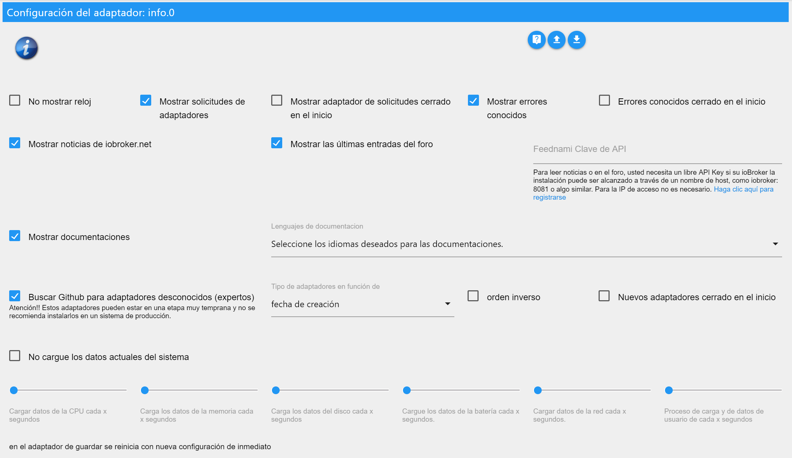
</p>

* **No mostrar reloj** - Para ocultar el reloj en la parte superior izquierda.
* **Ocultar eventos (solo alemán)** - El calendario de eventos no se muestra
* **Mostrar solicitudes de adaptador **: muestra el panel con las solicitudes de adaptador.
    * **Las solicitudes de adaptador se cerraron en el inicio** - El panel con las solicitudes de adaptador se cierra cuando se inicia la ventana de información.
* **Ver errores conocidos **: muestra el panel con errores conocidos y solicitudes de adaptadores instalados.
    * **Errores conocidos al inicio cerrado **: el panel con los errores conocidos se cierra al iniciar la ventana de información.

* **Mostrar noticias de iobroker.net **: muestra el panel con las noticias oficiales de ioBroker.
* **Mostrar las últimas entradas del foro **: muestra el panel con las últimas entradas del foro.
* **Clave de API de Feednami** - Si llama a ioBroker con un nombre de host, como iobroker: 8081 o algo así, debe registrarse de forma gratuita en Feednami para obtener una clave de API adecuada. Esto no es necesario para acceder a través de una dirección IP.

* **Mostrar documentación **: muestra el botón de la documentación.
    * **Seleccione los idiomas requeridos para la documentación** - Selección de los idiomas que se incluirán en la documentación. (Es posible que tenga que hacer clic en el nombre a la derecha para seleccionar qué - predeterminado -> configurar idioma + inglés)

* **Buscar en Github para adaptadores desconocidos (expertos)** - Muestra el panel en busca de adaptadores no aprobados en el github.
    * **Ordenar adaptador por **: ordena el resultado de la búsqueda por nombre, fecha de creación o última actualización.
    * **orden inverso** - invierte el orden de los resultados.
    * **Nuevos adaptadores cerrados al inicio **: el panel con los adaptadores desconocidos se cierra al iniciar la ventana de información.

* **Token de acceso personal GitHub** - Para poder crear nuevos problemas o solicitudes de adaptadores en Github directamente desde ioBroker, necesita un token que se pueda generar allí. Esto requiere una cuenta Github.
Para obtener el token, inicie sesión en Github, haga clic en el icono del usuario en la esquina superior derecha, vaya a "Settings", luego a "Developer settings"> "Personal access tokens". Allí, haga clic en "Generate new token", escriba cualquier nombre en "Token description" y seleccione "Scope", "repo". Luego obtienes un token y lo ingresas en el ioBroker. Puede encontrar instrucciones más detalladas en inglés [aquí](https://help.github.com/en/articles/creating-a-personal-access-token-for-the-command-line).


* **No cargar los datos actuales del sistema** - Los datos actuales del sistema no se cargan cíclicamente.
    * **Cargar datos de la CPU cada x segundos** - Los datos de la CPU se cargan cíclicamente cada 1 a 10 segundos. (0 está desactivado - por defecto 3)
    * **Cargar datos de la memoria cada x segundos** - Los datos de la memoria se cargan cíclicamente cada 1 a 10 segundos. (0 está desactivado - por defecto 3)
    * **Cargar datos del disco cada x segundos** - Los datos del disco duro se cargan cíclicamente cada 1 a 10 segundos. (0 está desactivado - por defecto 8)
    * **Cargar datos de la batería cada x segundos** - Cargue los datos de la batería cíclicamente cada 1 a 10 segundos. (0 está desactivado - por defecto 8)
    * **Cargar datos de red cada x segundos** - Cargar datos de red cíclicamente cada 1 a 10 segundos. (0 está desactivado - por defecto 3)
    * **Cargar datos de proceso y de usuario cada x segundos** - Los datos de proceso y de usuario se cargan cíclicamente cada 1 a 10 segundos. (0 está desactivado - por defecto 8)

Con el sistema Windows, la carga cíclica de los datos del sistema no debería ocurrir demasiado rápido, ya que esto causa una carga considerable en el sistema. Los valores predeterminados se han seleccionado para ejecutarse sin problemas en la mayoría de los sistemas.

# Ficha de información

La pestaña Información contiene información diversa sobre su sistema y el ioBroker. La pestaña está dividida en diferentes bloques que se pueden personalizar. Casi todos los bloques se pueden abrir o abrir con un solo clic en .

## Reloj

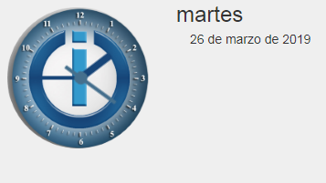
El reloj no tiene una función especial (pero he hecho un esfuerzo) y se puede apagar en cualquier momento en la configuración.

## Barra de Github

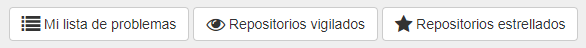
Para ver esta barra, primero necesita una cuenta de Github y debe especificar un token en la configuración. Para obtener más información, consulte [Descripción de la configuración](#Configuración) > "Ficha de acceso personal de GitHub".

En este momento, tiene la posibilidad de ver los problemas creados por usted, problemas asignados y los repositorios que se observan o marcan con una estrella.

Al hacer clic en , se pueden mostrar todos los comentarios sobre el problema. El botón solo aparece si hay comentarios disponibles. El número total de comentarios se muestra en el globo antes del título del problema.

## Mensajes

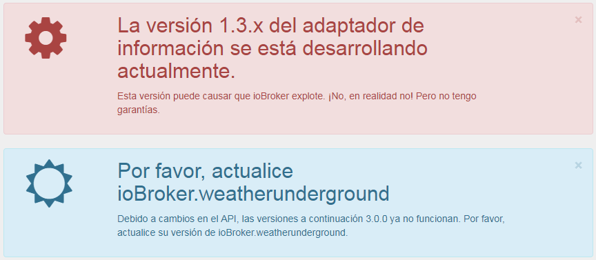
Para enviar rápidamente mensajes importantes relacionados con ioBroker al usuario, se creó la posibilidad de crear mensajes. Estos mensajes aparecen SOLAMENTE si se aplican ciertas condiciones. Por lo tanto, no se muestran mensajes sobre un adaptador si no está instalado. Esto garantiza que SOLO se advierta a los usuarios, que también se ven afectados por el problema.

Los mensajes se pueden cerrar con un clic, en la esquina superior derecha de , pero aparecen de nuevo en cuanto se vuelve a cargar la pestaña de información, siempre que el problema persista.

Para el uso de mensajes con otros adaptadores como Javascript, Telegram, Alexa, etc., ya están filtrados en el objeto "newsfeed_filtered", almacenado como una matriz de objetos.

Ejemplo:
```javascript
const messages = JSON.parse(getState('info.0.newsfeed_filtered').val);
messages.forEach(message => {
    const title = message.title;
    const text = message.content;
    const created = new Date(message.created);
    console.log(created + " " + title + " " + text);
});
```

### Mensajes (VIS-Widget)


Para los mensajes, se creó un widget VIS, que también aparece solo si los mensajes se refieren al usuario. Si no hay mensajes, no se muestra nada, por lo que no necesita espacio adicional en la superficie VIS para los mensajes, sino simplemente. en el medio de la pantalla.

## Documentación

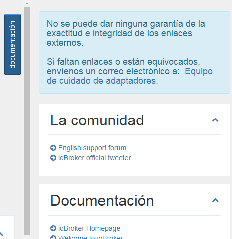
Hemos reunido una lista de enlaces importantes. Puede encontrar esto como una lista desplegable haciendo clic en el botón en la parte superior derecha "Documentación". Si el botón no está visible, asegúrese de que el elemento correspondiente en la configuración esté marcado.

Los enlaces individuales se almacenan en diferentes categorías: Comunidad, Documentación, Noticias, Blog, Lista de reproducción de videos, Desarrollo y Otros

Para la corrección y la integridad de los enlaces externos, no se puede dar ninguna garantía. Si faltan enlaces o son incorrectos, envíenos un correo electrónico.

## Actualizaciones

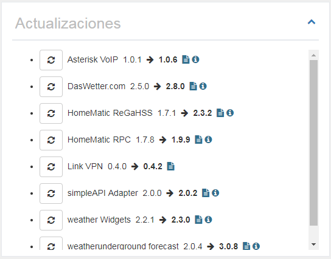
Si se lanzan nuevas versiones de un adaptador y también lo tiene instalado, aparecerá en esta lista.

Desde aquí puede actualizar directamente con un clic en .
Cuando muevas el mouse sobre , verás los cambios más importantes desde tu lanzamiento.
Haga clic en  para mostrar la descripción completa del adaptador.

Si el host (es decir, JS-Controller) está desactualizado, aparecerá un cuadro adicional debajo de "Nuevos adaptadores" con el mensaje de que debe actualizar el host.

## Nuevos adaptadores

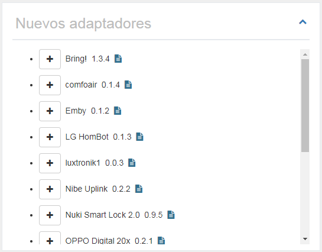
Aquí se muestran todos los adaptadores nuevos y lanzados oficialmente de los últimos 60 días.

Desde aquí puede instalar directamente el nuevo adaptador haciendo clic en .
Haga clic en  para mostrar la descripción completa del adaptador.

<br>

## Información del sistema

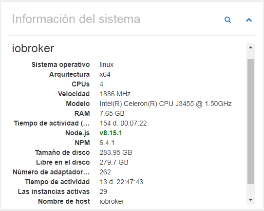
La información del sistema del sistema ioBroker se muestra aquí. En el caso de los sistemas con múltiples hosts, por supuesto, también se muestra la información de los otros hosts. Estos datos provienen del controlador JS.

La siguiente información (por host) se proporciona como información:

- Sistema operativo (linux, win32, darwin, android, aix, freebsd, openbsd o sunos)
- Arquitectura (brazo, brazo64, ia32, mips, mipsel, ppc, ppc64, s390, s90x, x32 y x64)
- CPUs (número de núcleos)
- Velocidad (velocidad del procesador)
- Modelo (modelo procesador)
- RAM (memoria total aproximada)
- Tiempo de funcionamiento del sistema (cuánto tiempo ha estado funcionando el sistema)
- Node.js (la versión de Node.js - si es una versión más reciente o si su versión está desactualizada, esta información también está aquí)
- NPM (versión NPM)
- Tamaño del disco duro (tamaño del disco duro donde se encuentra ioBroker)
- Disco duro libre (cuánto espacio queda disponible)
- número de adaptadores (cuántos adaptadores se han lanzado para ioBroker hasta ahora)
- Tiempo de operación (cuánto tiempo se ejecuta el ioBroker sin reiniciar)
- Instancias activas (cuántas instancias de adaptador se están ejecutando actualmente en este host)
- nombre de host (nombre del host)

```
Si falta información, debe instalarse una versión reciente del JS-Controller.
Este es el conjunto de datos del JS-Controller v1.5.7.
```

Al hacer clic en  se muestra información detallada sobre el sistema principal.

### Información del sistema (vista detallada)

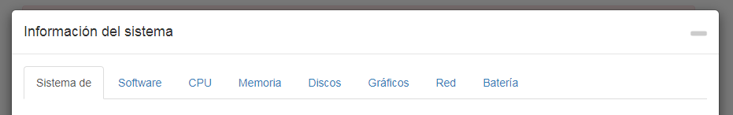

Aquí una gran cantidad de información sobre el sistema de la casa se muestra y se almacena como un objeto. Estos pueden ser utilizados por usted bastante cómodamente. La mayoría de los datos solo se leen y guardan cuando el adaptador se carga por primera vez, ya que estos no cambian tan fácilmente.

Algunos datos también se actualizan cíclicamente. La frecuencia con que esto sucede se puede configurar en la configuración.

Tenga en cuenta que no toda la información está disponible en todos los sistemas operativos, lo que puede ocasionar que no se muestre cierta información.

#### sistema

Aquí se muestran los datos del hardware: placa base, biografías, estuches, etc.

#### Software

El software incluye datos sobre el sistema operativo, el software instalado, los procesos en ejecución y los usuarios registrados.

#### Procesador central

Aquí puede encontrar datos sobre la CPU, como la velocidad, la carga y la temperatura.

**Problemas con Windows:** wmic se usa para detectar la temperatura de un sistema Windows. En algunos casos, wmic debe ejecutarse con privilegios de administrador. Por lo tanto, si no obtiene ningún valor, intente ejecutarlo nuevamente con los permisos apropiados. Si aún no obtiene ningún valor, es posible que su sistema no admita esta función.

**Problemas con Linux:** En algunos casos, necesita instalar el paquete del sensor de Linux para medir la temperatura, por ejemplo. en sistemas basados ​​en DEBIAN ejecutando:

```
$ sudo apt-get install lm-sensores
```

#### Memoria principal

Aquí están todos los datos a la memoria principal como la memoria libre o los datos a la barra de RAM.

#### Discos duros

Todos los datos en discos duros, particiones, raids y ROMs.

**Problemas con Linux:** Para poder usar el S.M.A.R.T. Para ver el estado de Linux, necesita instalar smartmontools. En las distribuciones de Linux basadas en DEBIAN, puede instalarlo haciendo lo siguiente:

```
$ sudo apt-get install smartmontools
```

#### Gráfico

Los datos sobre el controlador o monitor se muestran aquí, si están disponibles / son compatibles.

#### Red

Todos los datos sobre las conexiones de red.

#### Batería

Todos los datos sobre la batería, si existe.

**Problemas con Windows:** wmic se usa para detectar el estado de la batería de un sistema Windows. En algunos casos, wmic debe ejecutarse con privilegios de administrador. Por lo tanto, si no obtiene ningún valor, intente ejecutarlo nuevamente con los permisos apropiados. Si aún no obtiene ningún valor, es posible que su sistema no admita esta función.

## Solicitudes de adaptador

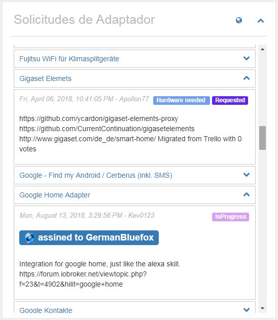
Todas las solicitudes de adaptadores se incluyeron en el github como un problema. Cualquiera que desee algo, puede ingresar su deseo aquí y cualquiera puede desarrollarlo, luego puede elegir un problema y desarrollar un adaptador a partir de él.

En esta lista se mostrará un título y al hacer clic en , se podrá ver información más detallada. Los enlaces anteriores cuando se creó el deseo, corresponden al estado actual y debajo de una descripción detallada. Si un desarrollador ha elegido la solicitud, aparecerá aquí como "asignado a".

Al hacer clic en , vienes directamente a Github y puedes agregar tus propios deseos allí.
Si hace clic en el título de un deseo, aterriza directamente en la solicitud de Github y puede votar por él. Los deseos con muchos votos son por supuesto preferidos.

El panel "Solicitudes del adaptador" se puede ocultar en la configuración o mostrar en el estado cerrado cuando se carga.

### Crear nueva solicitud de adaptador

Para crear una nueva solicitud, primero necesita una cuenta de Github y debe especificar un token en la configuración. Para obtener más información, consulte [Descripción de la configuración](#Configuración) > "Ficha de acceso personal de GitHub".

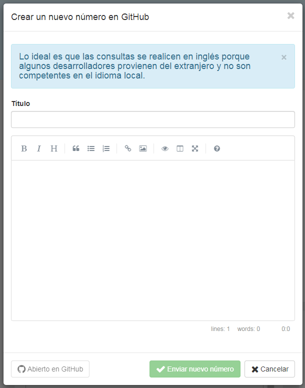
Si hace clic en , aparece una ventana donde tiene la posibilidad de crear un título y una descripción de la solicitud del adaptador.

Como título, seleccione siempre un término claro y corto, como "Panasonic TV". Luego describe tus deseos con la mayor precisión posible.
Si ya existen API conocidas para el producto, también debe escribir esto.
Cualquier información que pueda ayudar al desarrollador aumenta la probabilidad de que el adaptador correspondiente se desarrolle rápidamente. Si es posible, por favor escriba todo en inglés,
porque algunos desarrolladores vienen del extranjero y probablemente no hablen tu idioma.

Al hacer clic en "Enviar nuevo número", se creará un problema en Github. Ahora puede hacer clic en el botón azul de la izquierda para ir directamente al problema o simplemente cerrar la ventana.

### Votar por solicitudes de adaptadores

Con una cuenta de Github, también puede votar directamente por solicitudes de adaptadores haciendo clic . Si funciona, el botón se vuelve verde. Todos solo pueden votar un voto. El número total de voces se muestra en el objeto delante del título.

En la descripción general, las solicitudes de adaptador por las que ha votado se muestran en verde y las solicitudes de menos de 1 mes aparecen en azul.

## Mis adaptadores

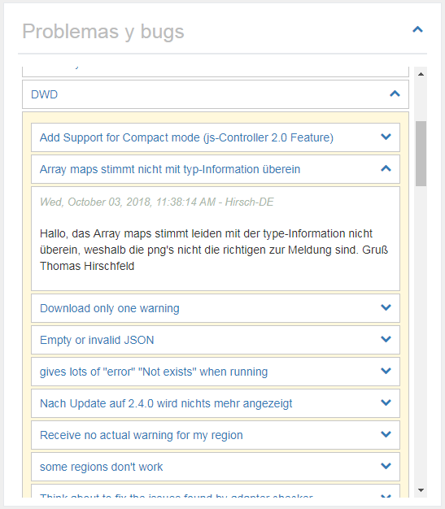
Por supuesto, ningún adaptador está libre de errores y algunos usuarios también pueden tener ideas de expansión. Todo lo que se sabe sobre los adaptadores instalados se recoge aquí. También puede utilizar esta lista para averiguar si el desarrollador también conoce un error que acaba de encontrar, porque solo se pueden corregir los errores conocidos.

Haga clic en , a la derecha del nombre del adaptador, se abrirá la lista de problemas / solicitudes conocidos. También se pueden abrir, donde encontrará una descripción detallada.

Si hace clic en el nombre del adaptador, puede ir directamente a la lista de Problemas en Github y posiblemente puede ingresar un nuevo error o desea expandirse.
Si hace clic en el título de un problema, termina directamente con el mensaje en Github y, opcionalmente, puede proporcionarle al desarrollador más información, y dejar un comentario.
Al hacer clic en , se pueden mostrar todos los comentarios sobre el problema. El botón solo aparece si hay comentarios disponibles. El número total de comentarios se muestra en el globo antes del título del problema.

El panel "Problemas y errores" se puede ocultar en la configuración o mostrar en el estado cerrado cuando se carga.

### Informar deseos o errores

Si abre un adaptador, tiene la opción de informar un nuevo error o hacer sugerencias para mejorarlo haciendo clic en 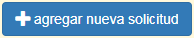. Esto requiere una cuenta Github y un token en la configuración. Se pueden encontrar más detalles en [Descripción de la configuración](#Configuración) > "Ficha de acceso personal de GitHub".

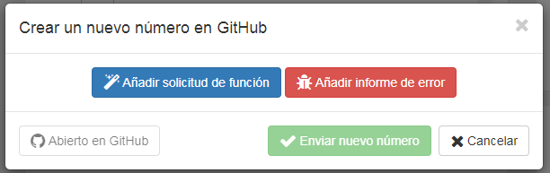
Al hacer clic, tiene la oportunidad de realizar una propuesta de mejora (azul) o informar un error (rojo). Ambas opciones le permiten ingresar un título y una descripción.

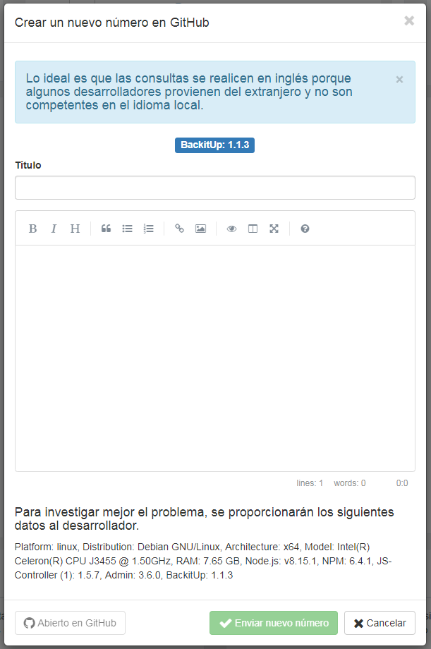
El título debe darle una descripción clara y concisa del problema. Al describir, no debes ser frugal con la información. Cada detalle puede ayudar al desarrollador a implementar el problema o deseo más rápido. Si es posible, por favor escriba todo en inglés, porque algunos desarrolladores vienen del extranjero y probablemente no hablan tu idioma.

Al hacer clic en "Enviar nuevo número", se creará un problema en Github. Ahora puede hacer clic en el botón azul de la izquierda para ir directamente al problema o simplemente cerrar la ventana.

### Marca el adaptador como favorito

Los desarrolladores sacrifican mucho tiempo libre para desarrollar adaptadores para ti. Esta es tu oportunidad, siempre que se haya ingresado un token de Guthub, haciendo clic en  para agradecer a los desarrolladores por su trabajo. Todos solo pueden votar un voto. El número total de votos se mostrará en el objeto antes del título.

En la descripción general, los adaptadores que han sido favorecidos por usted se muestran en verde.

## adaptador ioBroker en Github

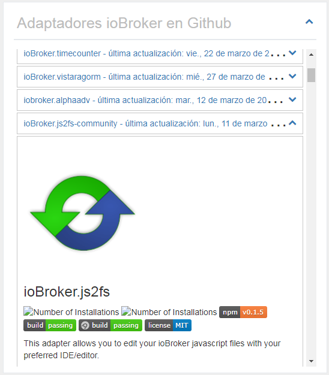
El número de adaptadores oficiales para ioBroker ya es considerable. Por supuesto, hay muchos más adaptadores disponibles en la red. Estos son buscados y mostrados aquí.

Si abre el panel con un clic en , la descripción completa del adaptador se muestra aquí.

El panel "adaptador ioBroker en Github" puede ocultarse en la configuración o mostrarse en estado cerrado cuando se carga. También puede ajustar el orden de clasificación.

```
¡¡¡CUIDADO!!! Estos adaptadores pueden estar en una etapa muy temprana de desarrollo.
Estos no deben instalarse en un sistema de producción.
Cada instalación es bajo su propio riesgo!
```

## Noticias

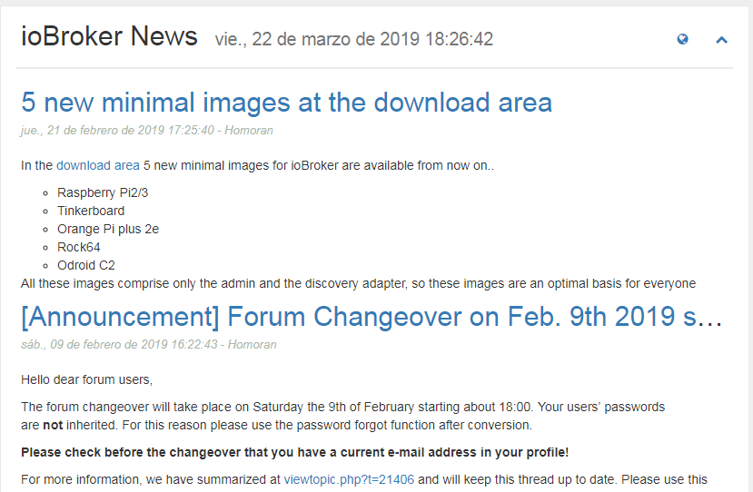
De vez en cuando, se publicarán noticias oficiales del equipo ioBroker. Aquí se mostrarán.

Haga clic en  para acceder directamente a la página oficial de ioBroker.

Las noticias se muestran sin problemas al acceder a ioBroker a través de IP o localhost: 8081. Pero si usa un nombre de host como meinhaus.de:8081, debe obtener una clave API gratuita en Feednami. Para registrarse, haga clic en [aquí](https://toolkit.sekando.com/docs/en/setup/hostnames) y siga las instrucciones.

## Foro

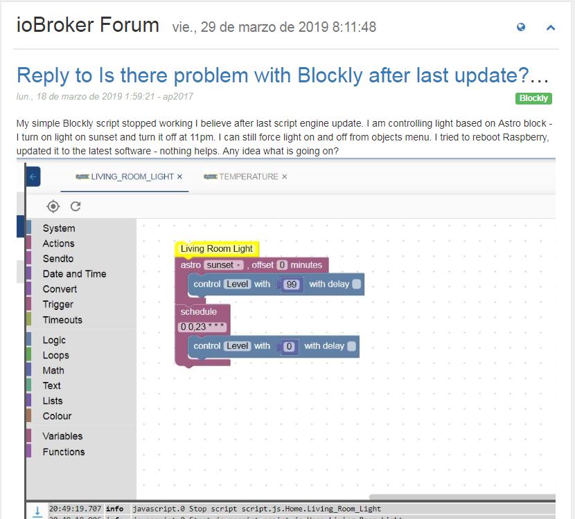
Aquí las últimas entradas del foro se muestran en el idioma seleccionado. Si no hay un foro en el idioma, entonces los datos se mostrarán en el foro en inglés.

Haga clic en  para acceder directamente al foro.

Las entradas del foro se mostrarán sin problemas al acceder a ioBroker a través de IP o localhost: 8081. Pero si usa un nombre de host como meinhaus.de:8081, debe obtener una clave API gratuita en Feednami. Para registrarse, haga clic en [aquí](https://toolkit.sekando.com/docs/en/setup/hostnames) y siga las instrucciones.