# Admin

Info Adapter a été développé pour fournir diverses informations sur le système, sur ioBroker et sur des sujets pertinents pour l'utilisateur. L'utilisateur doit avoir un aperçu de toutes les données intéressantes et importantes et l'équipe ioBroker aura la possibilité de le contacter encore plus rapidement, si des informations importantes sont disponibles.

# Installation

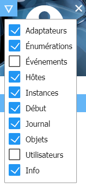
Pour voir la fenêtre d’informations dans l’onglet Onglet, vous devez d’abord vérifier qu’elle est visible dans l’administrateur après l’installation. Pour ce faire, cliquez sur le triangle de gauche dans le coin supérieur gauche de la fenêtre Admin et sélectionnez "Info" dans le menu.

# Configuration

<p align="center">
    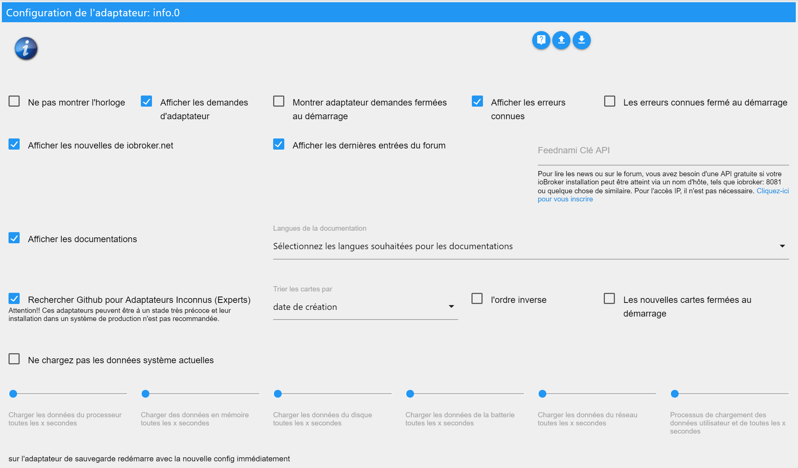
</p>

* **Ne pas afficher l'horloge** - Pour masquer l'horloge en haut à gauche.
* **Masquer les événements (seulement en allemand)** - Calendrier de l'événement n'est pas affiché
* **Afficher les demandes d'adaptateur** - Affiche le panneau avec les demandes d'adaptateur.
    * **Demandes d'adaptateur fermées au démarrage** - Le panneau contenant les demandes d'adaptateur est fermé au démarrage de la fenêtre Info.
* **Afficher les erreurs connues** - Affiche le panneau avec les erreurs connues et les demandes d'adaptateurs installés.
    * **Erreurs connues au démarrage fermées** - Le panneau avec les erreurs connues est fermé lors du démarrage de la fenêtre d'informations.

* **Afficher les nouvelles de iobroker.net** - Affiche le panneau avec les nouvelles officielles de ioBroker.
* **Afficher les dernières entrées du forum** - Affiche le panneau avec les dernières entrées du forum.
* **Clé API Feednami** - Si vous appelez ioBroker en utilisant un nom d’hôte, tel que iobroker: 8081 ou quelque chose du genre, vous devez vous inscrire gratuitement à Feednami pour obtenir une clé API appropriée. Ceci n'est pas nécessaire pour l'accès via une adresse IP.

* **Afficher la documentation** - Affiche le bouton de la documentation.
    * **Sélectionnez les langues requises pour la documentation** - Sélection des langues à inclure dans la documentation. (Vous devrez peut-être cliquer sur le nom à droite pour sélectionner quoi - par défaut -> définir langue + anglais)

* **Rechercher des adaptateurs inconnus dans le github (experts)** - Affiche le panneau à la recherche d’adaptateurs non approuvés dans le github.
    * **Sort Adapter by** - Trie le résultat de la recherche par nom, date de création ou dernière mise à jour.
    * **ordre inverse** - inverse l'ordre des résultats.
    * **Nouveaux adaptateurs fermés au démarrage** - Le panneau contenant les adaptateurs inconnus est fermé lors du démarrage de la fenêtre d'informations.

* **Jeton d'accès personnel GitHub** - Pour pouvoir créer de nouveaux problèmes ou de nouvelles demandes d’adaptateur sur Github directement à partir de ioBroker, vous avez besoin d’un jeton pouvant être généré ici. Cela nécessite un compte Github.
Pour obtenir le jeton, connectez-vous à Github, cliquez sur l'icône de l'utilisateur dans le coin supérieur droit, allez à "Settings", puis "Developer settings"> "Personal access tokens". Là, cliquez sur "Generate new token", tapez n'importe quel nom sous "Token description" et sélectionnez comme "Scope", "repo". Ensuite, vous obtenez un jeton et entrez-le dans ioBroker. Vous trouverez des instructions plus détaillées en anglais [ici](https://help.github.com/en/articles/creating-a-personal-access-token-for-the-command-line).


* **Ne pas charger les données système actuelles** - Les données système actuelles ne sont pas chargées de manière cyclique.
    * **Charger les données de la CPU toutes les x secondes** - Les données de la CPU sont chargées cycliquement toutes les 1 à 10 secondes. (0 est désactivé - 3 par défaut)
    * **Charger les données de la mémoire toutes les x secondes** - Les données de la mémoire sont chargées de manière cyclique toutes les 1 à 10 secondes. (0 est désactivé - 3 par défaut)
    * **Charger les données du disque toutes les x secondes** - Les données du disque dur sont chargées de manière cyclique toutes les 1 à 10 secondes. (0 est désactivé - 8 par défaut)
    * **Charger les données de la batterie toutes les x secondes** - Chargez les données de la batterie de façon cyclique toutes les 1 à 10 secondes. (0 est désactivé - 8 par défaut)
    * **Charger les données du réseau toutes les x secondes** - Chargez les données du réseau de manière cyclique toutes les 1 à 10 secondes. (0 est désactivé - 3 par défaut)
    * **Charger les données de processus et d'utilisateur toutes les x secondes** - Les données de processus et d'utilisateur sont chargées de manière cyclique toutes les 1 à 10 secondes. (0 est désactivé - 8 par défaut)

Avec le système Windows, le chargement cyclique des données du système ne devrait pas être trop rapide, car cela entraînerait une charge considérable sur le système. Les valeurs par défaut ont été sélectionnées pour s'exécuter sans problème sur la plupart des systèmes.

# Onglet Info

L'onglet Info contient diverses informations sur votre système et ioBroker. L'onglet est divisé en différents blocs pouvant être personnalisés. Presque tous les blocs peuvent être ouverts ou ouverts en un seul clic sur .

## L'horloge

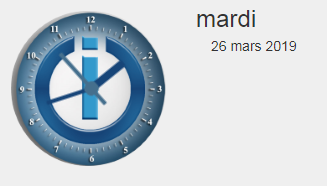
L'horloge n'a pas de fonction particulière (mais j'ai fait un effort) et peut être désactivée à tout moment dans la configuration.

## Barre Github


Pour voir cette barre, vous devez d'abord disposer d'un compte Github et spécifier un jeton dans la configuration. Pour plus d'informations, voir [Description de la configuration](#Configuration) > "Jeton d'accès personnel GitHub".

Pour le moment, vous avez la possibilité de voir les problèmes créés par vous-même, questions assignées et les référentiels observés ou marqués d'une étoile.

En cliquant sur , tous les commentaires sur le problème peuvent être affichés. Le bouton n'apparaît que si des commentaires sont disponibles. Le nombre total de commentaires est indiqué dans la bulle avant le titre de la publication.

## Messages

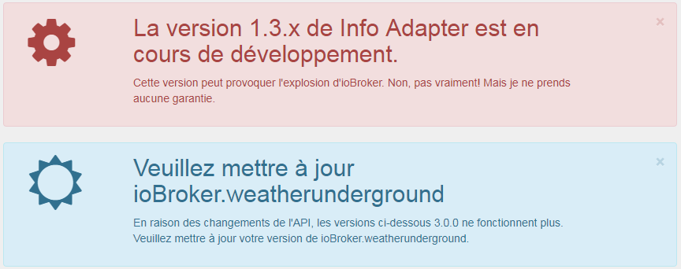
Afin d'envoyer rapidement à l'utilisateur des messages importants concernant ioBroker, la possibilité de créer des messages a été créée. Ces messages apparaissent UNIQUEMENT si certaines conditions s'appliquent. Donc, aucun message n'est affiché sur un adaptateur s'il n'est pas installé. Cela garantit que SEUL les utilisateurs sont avertis et sont également concernés par le problème.

Les messages peuvent être fermés en un clic, dans le coin supérieur droit de , mais ils réapparaissent dès le rechargement de l'onglet info, tant que le problème persiste.

Pour l'utilisation de messages avec d'autres adaptateurs tels que Javascript, Telegram, Alexa, etc., ils sont déjà filtrés dans l'objet "newsfeed_filtered", stocké sous la forme d'un tableau d'objets.

Exemple:
```javascript
const messages = JSON.parse(getState('info.0.newsfeed_filtered').val);
messages.forEach(message => {
    const title = message.title;
    const text = message.content;
    const created = new Date(message.created);
    console.log(created + " " + title + " " + text);
});
```

### Messages (VIS-Widget)


Pour les messages, un widget VIS a été créé. Il apparaît également uniquement si les messages concernent l'utilisateur. S'il n'y a pas de message, rien ne s'affiche, vous n'avez donc pas besoin d'espace supplémentaire sur la surface du VIS pour les messages, mais simplement de l'espace. au milieu de l'écran.

## Documentation

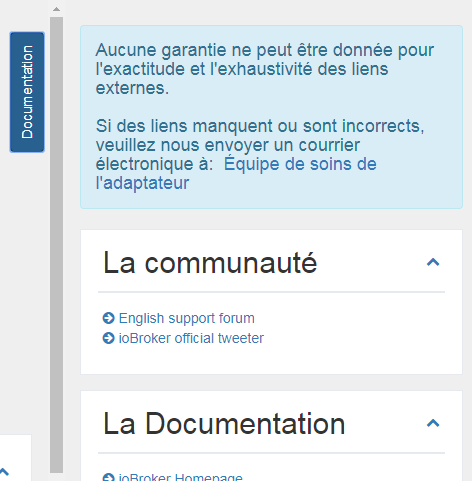
Nous avons dressé une liste de liens importants. Vous pouvez le trouver sous forme de liste déroulante en cliquant sur le bouton en haut à droite "Documentation". Si le bouton n'est pas visible, assurez-vous que l'élément correspondant dans la configuration est coché.

Les liens individuels sont stockés dans différentes catégories: Communauté, Documentation, Actualités, Blog, Playlist vidéo, Développement et autres

Pour l'exactitude et l'intégralité des liens externes, aucune garantie ne peut être donnée. Si des liens sont manquants ou incorrects, veuillez nous envoyer un e-mail.

## Mises à jour

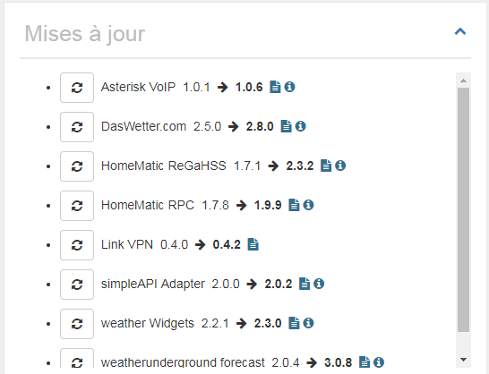
Si de nouvelles versions d'un adaptateur sont publiées et que vous l'avez également installé, il apparaîtra dans cette liste.

À partir de là, vous pouvez directement mettre à jour en cliquant sur .
Lorsque vous passez la souris sur , vous verrez les modifications les plus importantes depuis votre publication.
Cliquez sur  pour afficher la description complète de l'adaptateur.

Si l'hôte - c'est-à-dire JS-Controller - est obsolète, une boîte supplémentaire apparaît sous "Nouveaux adaptateurs" avec le message que vous devez mettre à jour l'hôte.

## Nouveaux adaptateurs

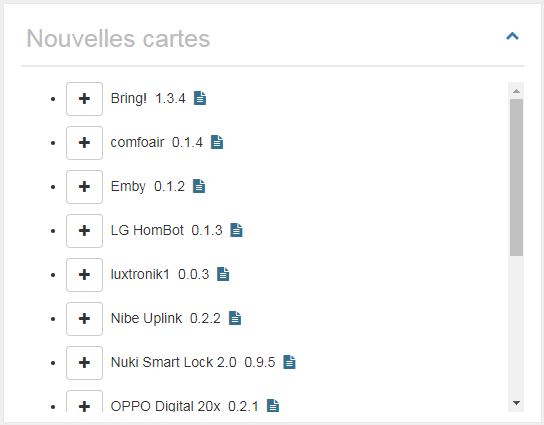
Tous les adaptateurs nouveaux et officiellement publiés des 60 derniers jours sont affichés.

À partir de là, vous pouvez directement installer le nouvel adaptateur en cliquant sur .
Cliquez sur  pour afficher la description complète de l'adaptateur.

<br>

## Informations système

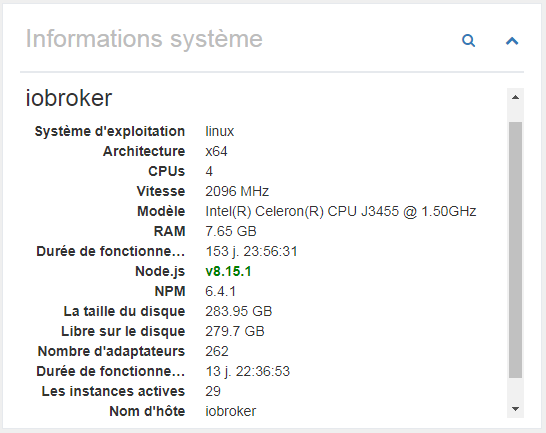
Les informations système du système ioBroker sont affichées ici. Dans le cas de systèmes multi-hôtes, bien sûr, les informations des autres hôtes sont également affichées. Ces données proviennent du JS-Controller.

Les informations suivantes (par hôte) sont fournies à titre d’informations:

- Système d'exploitation (linux, win32, darwin, android, aix, freebsd, openbsd ou sunos)
- Architecture (arm, arm64, ia32, mips, mipsel, ppc, ppc64, s390, s90x, x32 et x64)
- CPU (nombre de cœurs)
- Vitesse (vitesse du processeur)
- Modèle (modèle de processeur)
- RAM (mémoire totale approximative)
- Durée de fonctionnement du système (depuis combien de temps le système fonctionne-t-il)
- Node.js (La version de Node.js - s'il s'agit d'une version plus récente ou que votre version est obsolète, ces informations sont également disponibles)
- NPM (version NPM)
- Taille du disque dur (taille du disque dur sur lequel se trouve ioBroker)
- Disque dur libre (combien d'espace est encore disponible)
- nombre d'adaptateurs (combien d'adaptateurs ont été libérés pour ioBroker jusqu'à présent)
- Durée de fonctionnement (combien de temps l'ioBroker est-il exécuté sans redémarrage)
- Instances actives (combien d'instances d'adaptateur sont en cours d'exécution sur cet hôte)
- nom d'hôte (nom de l'hôte)

```
Si des informations sont manquantes, une version récente du JS-Controller doit être installée.
C'est le jeu de données de JS-Controller v1.5.7.
```

Cliquez sur  pour afficher des informations détaillées sur le système principal.

### Informations système (vue détaillée)

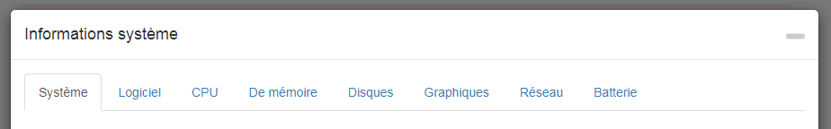

Ici, de nombreuses informations sur le système de la maison sont affichées et stockées en tant qu'objet. Ceux-ci peuvent alors être utilisés par vous assez confortablement. La plupart des données ne sont lues et sauvegardées que lorsque l'adaptateur est chargé, car elles ne changent pas aussi facilement.

Certaines données sont également mises à jour de manière cyclique. La fréquence à laquelle cela se produit peut être définie dans la configuration.

N'oubliez pas que toutes les informations ne sont pas disponibles dans tous les systèmes d'exploitation, ce qui peut empêcher certaines informations de s'afficher.

#### Système

Ici, les données matérielles sont affichées - carte mère, bios, boîtier, etc.

#### Logiciel

Le logiciel inclut des données sur le système d'exploitation, les logiciels installés, les processus en cours et les utilisateurs connectés.

#### Processeur central

Vous y trouverez des données relatives au processeur, telles que la vitesse, la charge et la température.

**Problèmes avec Windows:** wmic est utilisé pour détecter la température d'un système Windows. Dans certains cas, wmic doit être exécuté avec des privilèges d'administrateur. Donc, si vous n'obtenez aucune valeur, essayez de l'exécuter à nouveau avec les autorisations appropriées. Si vous n'obtenez toujours aucune valeur, votre système peut ne pas prendre en charge cette fonctionnalité.

**Problèmes avec Linux:** Dans certains cas, vous devez installer le package de capteur Linux pour mesurer la température, par exemple. sur les systèmes basés sur DEBIAN en exécutant:

```
$ sudo apt-get install lm-sensors
```

#### Mémoire principale

Voici toutes les données stockées dans la mémoire principale, telles que la mémoire disponible, ou les données stockées dans la barre RAM.

#### Disques durs

Toutes les données sur les disques durs, les partitions, les raids et les ROM.

**Problèmes avec Linux:** Pour pouvoir utiliser le logiciel S.M.A.R.T. Pour voir l'état de Linux, vous devez installer smartmontools. Sur les distributions Linux basées sur DEBIAN, vous pouvez l’installer en procédant comme suit:

```
$ sudo apt-get install smartmontools
```

#### Graphique

Les données relatives au contrôleur ou au moniteur sont affichées ici, si elles sont disponibles / prises en charge.

#### Réseau

Toutes les données sur les connexions réseau.

#### Batterie

Toutes les données sur la batterie, s'il en existe une.

**Problèmes avec Windows:** wmic est utilisé pour détecter l'état de la batterie d'un système Windows. Dans certains cas, wmic doit être exécuté avec des privilèges d'administrateur. Donc, si vous n'obtenez aucune valeur, essayez de l'exécuter à nouveau avec les autorisations appropriées. Si vous n'obtenez toujours aucune valeur, votre système peut ne pas prendre en charge cette fonctionnalité.

## Demandes d'adaptateur

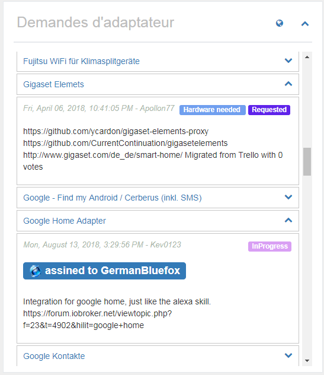
Toutes les demandes d'adaptateurs ont été incluses dans le github en tant que problème. Toute personne qui souhaite quelque chose peut écrire ici son souhait et tout le monde peut développer, puis choisir un problème et en développer un adaptateur.

Dans cette liste, un titre sera affiché et en cliquant sur , des informations plus détaillées seront visibles. Au-dessus des liens lorsque le souhait a été créé, à droite le statut actuel et ci-dessous une description détaillée. Si un développeur a choisi la demande, celle-ci sera listée ici comme "assined to".

En cliquant sur , vous arrivez directement sur Github et pouvez y ajouter vos propres souhaits.
Si vous cliquez sur le titre d'un souhait, vous arrivez directement à la demande de Github et vous pouvez voter pour. Les souhaits avec beaucoup de votes sont bien sûr préférés.

Le panneau "Requêtes de l'adaptateur" peut être masqué dans la configuration ou affiché à l'état fermé lors du chargement.

### Créer une nouvelle demande d'adaptateur

Pour créer une nouvelle demande, vous devez d'abord disposer d'un compte Github et spécifier un jeton dans la configuration. Pour plus d'informations, voir [Description de la configuration](#Configuration) > "Jeton d'accès personnel GitHub".

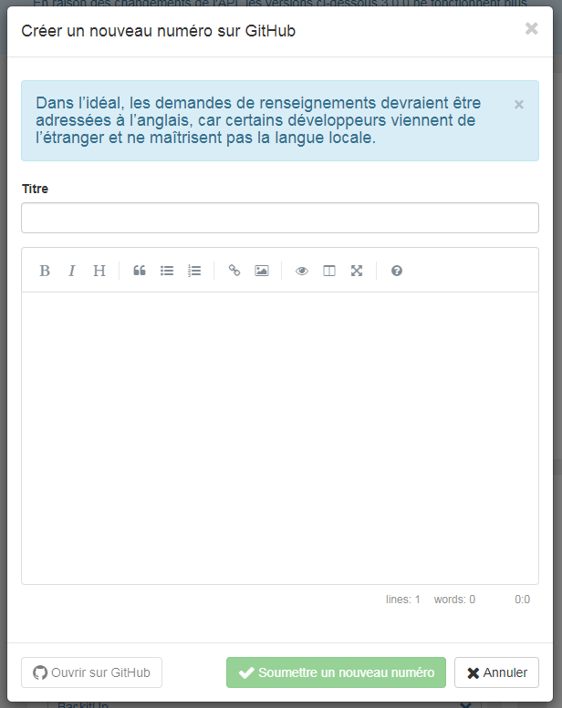
Si vous cliquez sur , une fenêtre apparaît dans laquelle vous avez la possibilité de créer un titre et une description de la demande d'adaptateur.

En tant que titre, sélectionnez toujours un terme clair et court, tel que "Panasonic TV". Ensuite, décrivez vos souhaits aussi précisément que possible.
Si des API déjà connues existent pour le produit, vous devez également écrire ceci.
Toute information susceptible d'aider le développeur augmente les chances que l'adaptateur correspondant soit développé rapidement. Si possible, écrivez tout en anglais,
parce que certains développeurs viennent de l'étranger et qu'ils ne parlent probablement pas votre langue.

En cliquant sur "Soumettre un nouveau numéro", un problème sera créé sur Github. Maintenant, vous pouvez cliquer sur le bouton bleu à gauche pour accéder directement au problème ou simplement fermer la fenêtre.

### Votez pour les demandes d'adaptateur

Avec un compte Github, vous pouvez également voter directement pour les demandes d'adaptateurs en cliquant . Si cela fonctionne, le bouton devient vert. Tout le monde ne peut voter qu'une voix. Le nombre total de voix est affiché dans l'objet devant le titre.

Dans la vue d'ensemble, les demandes d'adaptateur pour lesquelles vous avez voté s'affichent en vert et les demandes de moins d'un mois en bleu.

## Mes adaptateurs

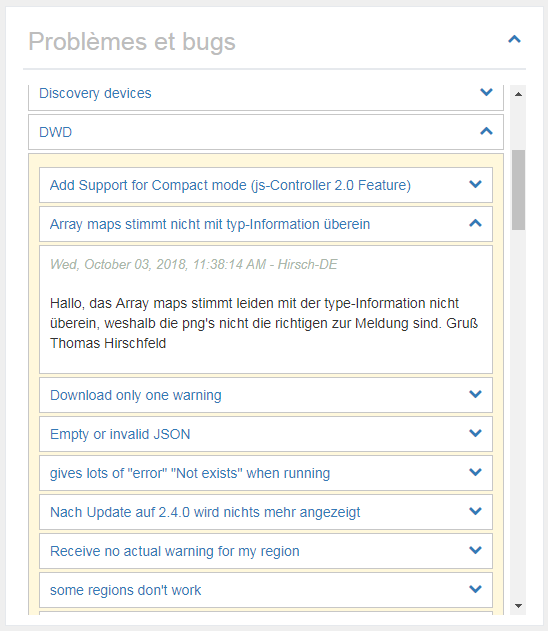
Bien entendu, aucun adaptateur n'est exempt d'erreur et certains utilisateurs peuvent également avoir des idées d'extension. Tout ce qui est connu sur les adaptateurs installés est rassemblé ici. Vous pouvez également utiliser cette liste pour savoir si un bogue que vous venez de trouver est également connu du développeur, car seuls les bogues connus peuvent être corrigés.

Cliquez sur , à droite du nom de l'adaptateur, ouvrira la liste des problèmes / demandes connus. Ceux-ci peuvent également être ouverts, où vous trouverez ensuite une description détaillée.

Si vous cliquez sur le nom de l'adaptateur, vous pouvez accéder directement à la liste des problèmes de Github et éventuellement entrer une nouvelle erreur ou souhaiter le développer.
Si vous cliquez sur le titre d'un problème, vous vous retrouvez directement avec le message sur Github et pouvez éventuellement fournir plus d'informations au développeur, laissez-le comme un commentaire.
En cliquant sur , tous les commentaires sur le problème peuvent être affichés. Le bouton n'apparaît que si des commentaires sont disponibles. Le nombre total de commentaires est indiqué dans la bulle avant le titre de la publication.

Le panneau "Problèmes et erreurs" peut être masqué dans la configuration ou affiché à l'état fermé lors du chargement.

### Signaler des souhaits ou des erreurs

Si vous ouvrez un adaptateur, vous avez la possibilité de signaler une nouvelle erreur ou de suggérer des améliorations en cliquant sur 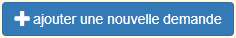. Cela nécessite un compte Github et un jeton dans la configuration. Vous trouverez plus de détails sous [Description de la configuration](#Configuration) > "Jeton d’accès personnel GitHub".

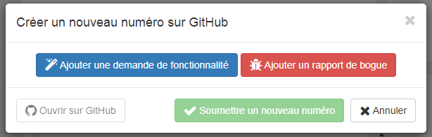
En cliquant, vous avez la possibilité de faire une proposition d'amélioration (en bleu) ou de signaler un bogue (en rouge). Les deux options vous permettent de saisir un titre et une description.

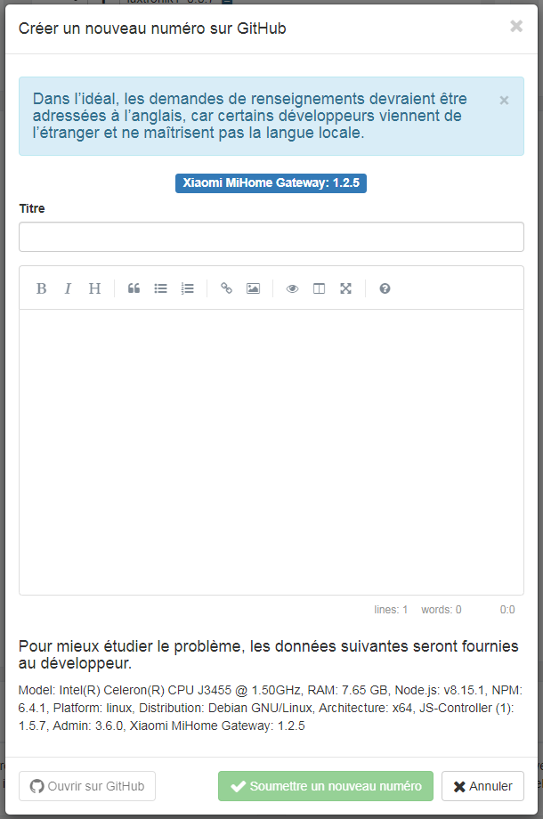
Le titre devrait vous donner une description claire et concise du problème. En décrivant, vous ne devriez pas être économe en informations. Chaque détail peut aider le développeur à mettre en œuvre le problème ou à désirer plus rapidement. Si possible, écrivez tout en anglais,
parce que certains développeurs viennent de l'étranger et qu'ils ne parlent probablement pas votre langue.

En cliquant sur "Soumettre un nouveau numéro", un numéro sera créé sur Github. Maintenant, vous pouvez cliquer sur le bouton bleu à gauche pour accéder directement au problème ou simplement fermer la fenêtre.

### Marquer l'adaptateur comme favori

Les développeurs sacrifient beaucoup de temps libre pour développer des adaptateurs pour vous. Voici votre chance, à condition qu'un Guthub soit entré, en cliquant sur  pour remercier les développeurs pour leur travail. Tout le monde ne peut voter qu'une voix. Le nombre total de votes sera affiché dans l'objet avant le titre.

Dans la vue d'ensemble, les adaptateurs que vous avez préférés sont affichés en vert.

## Adaptateur ioBroker sur Github

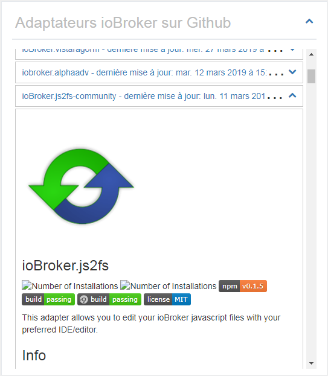
Le nombre d'adaptateurs officiels pour ioBroker est déjà considérable. Bien sûr, il existe de nombreux autres adaptateurs disponibles sur le net. Ceux-ci sont recherchés et affichés ici.

Si vous ouvrez le panneau en cliquant sur , la description complète de l'adaptateur s'affiche ici.

Le panneau "Adaptateur ioBroker sur Github" peut être masqué dans la configuration ou affiché à l'état fermé lors du chargement. Vous pouvez également ajuster l'ordre de tri.

```
FAIS ATTENTION!!! Ces adaptateurs peuvent être à un stade très précoce de développement.
Ceux-ci ne doivent pas être installés sur un système de production.
Chaque installation est à vos risques et périls!
```

## Nouvelles

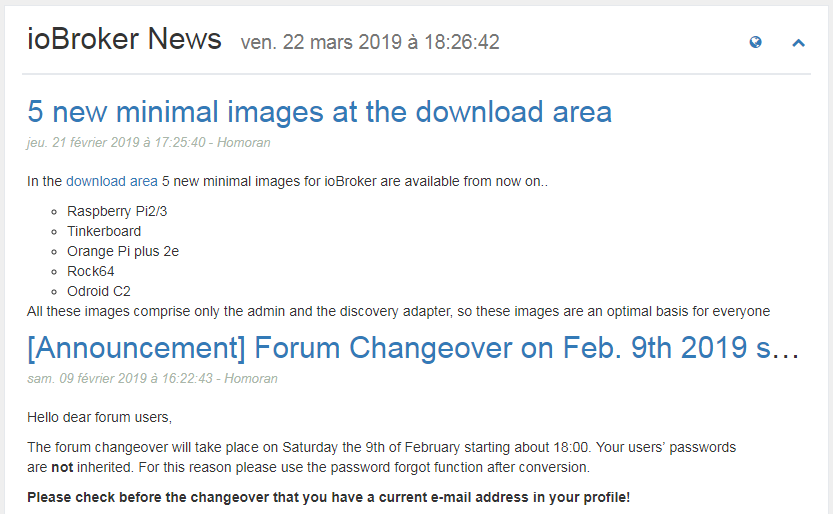
De temps en temps, des nouvelles officielles de l'équipe ioBroker seront publiées. Ici, ils seront affichés.

Cliquez sur  pour accéder directement à la page officielle d'ioBroker.

Les nouvelles sont affichées sans aucun problème lors de l'accès à ioBroker via IP ou localhost: 8081. Mais si vous utilisez un nom d’hôte tel que meinhaus.de:8081, vous devez obtenir une clé d’API gratuite à Feednami. Pour vous inscrire, cliquez [ici](https://toolkit.sekando.com/docs/fr/setup/hostnames) et suivez les instructions.

## Forum

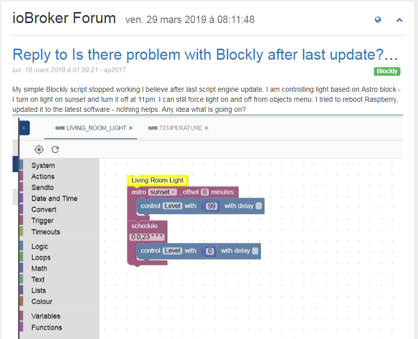
Ici les dernières entrées du forum sont affichées dans la langue sélectionnée. S'il n'y a pas de forum dans la langue, les données seront affichées sur le forum anglais.

Cliquez sur  pour accéder directement au forum.

Les entrées du forum s'afficheront sans problème lors de l'accès à ioBroker via IP ou localhost: 8081. Mais si vous utilisez un nom d’hôte tel que meinhaus.de:8081, vous devez obtenir une clé d’API gratuite à Feednami. Pour vous inscrire, cliquez [ici](https://toolkit.sekando.com/docs/fr/setup/hostnames) et suivez les instructions.