# Admin

L'adattatore di informazioni è stato sviluppato per fornire varie informazioni sul sistema, su ioBroker e argomenti pertinenti all'utente. L'utente dovrebbe avere una panoramica di tutti i dati interessanti e importanti e al team ioBroker verrà data l'opportunità di contattare l'utente ancora più velocemente, se sono disponibili informazioni importanti.

# Installazione

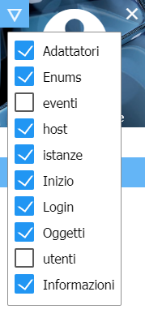
Per visualizzare la finestra informativa nella scheda Scheda, è necessario prima controllarla come Visibile nell'Amministrazione dopo l'installazione. Per fare ciò, fai clic sul triangolo a sinistra nell'angolo in alto a sinistra della finestra di amministrazione e seleziona "Informazioni" nel menu.

# Configurazione

<p align="center">
    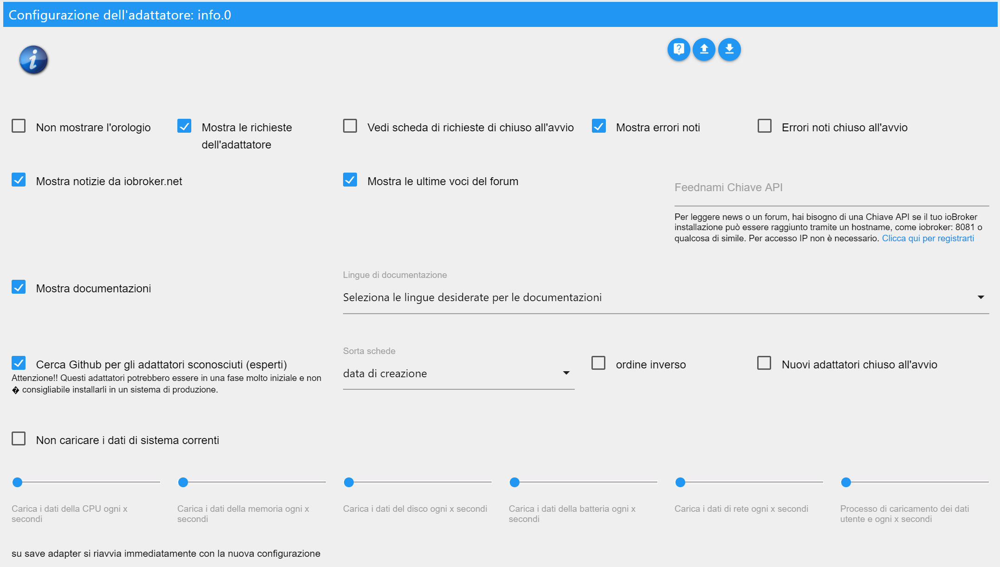
</p>

* **Non mostrare l'orologio** - Per nascondere l'orologio in alto a sinistra.
* **Nascondi eventi (solo tedesco)** - Il calendario degli eventi non viene visualizzato
* **Mostra richieste adattatore** - Visualizza il pannello con le richieste dell'adattatore.
    * **Richieste dell'adattatore chiuse all'avvio** - Il pannello con le richieste dell'adattatore viene chiuso all'avvio della finestra Informazioni.
* **Visualizza errori noti **: visualizza il pannello con errori noti e richieste di adattatori installati.
    * **Errori noti all'avvio chiuso** - Il pannello con gli errori noti viene chiuso all'avvio della finestra informativa.

* **Mostra notizie da iobroker.net** - Visualizza il pannello con le notizie ufficiali di ioBroker.
* **Mostra le ultime voci del forum** - Visualizza il pannello con le ultime voci del forum.
* **Chiave API Feednami** - Se chiami ioBroker usando un nome host, come iobroker: 8081 o qualcosa di simile, devi registrarti gratuitamente a Feednami per ottenere una chiave API appropriata. Questo non è necessario per l'accesso tramite un indirizzo IP.

* **Mostra documentazione** - Visualizza il pulsante per la documentazione.
    * **Selezionare le lingue richieste per la documentazione** - Selezione delle lingue da includere nella documentazione. (Potrebbe essere necessario fare clic sul nome sulla destra per selezionare cosa - impostazione predefinita -> imposta lingua + inglese)

* **Cerca Github per adattatori sconosciuti (esperti)** - Visualizza il pannello alla ricerca di adattatori non approvati nel github.
    * **Ordina scheda per** - Ordina il risultato della ricerca per nome, data di creazione o ultimo aggiornamento.
    * **ordine inverso** - inverte l'ordine dei risultati.
    * **Nuovi adattatori chiusi all'avvio** - Il pannello con gli adattatori sconosciuti viene chiuso all'avvio della finestra informativa.

* **GitHub token di accesso personale** - Per essere in grado di creare nuovi problemi o richieste di adattatori su Github direttamente da ioBroker, è necessario un token che può essere generato lì. Questo richiede un account Github.
Per ottenere il token, accedi a Github, fai clic sull'icona utente nell'angolo in alto a destra, vai su "Settings", quindi "Developer settings"> "Personal access tokens". Qui, fai clic su "Generate new token", digita un nome sotto "Token description" e seleziona "Scope", "repo". Quindi ottieni un token e inseriscilo in ioBroker. Puoi trovare istruzioni più dettagliate in inglese [qui](https://help.github.com/en/articles/creating-a-personal-access-token-for-the-command-line).


* **Non caricare i dati di sistema attuali** - I dati di sistema attuali non vengono caricati ciclicamente.
    * **Carica dati CPU ogni x secondi** - I dati della CPU vengono caricati ciclicamente ogni 1 - 10 secondi. (0 è disattivato - predefinito 3)
    * **Carica i dati della memoria ogni x secondi** - I dati della memoria vengono caricati ciclicamente ogni 1 - 10 secondi. (0 è disattivato - predefinito 3)
    * **Carica i dati del disco ogni x secondi** - I dati del disco rigido vengono caricati ciclicamente ogni 1 - 10 secondi. (0 è disattivato - predefinito 8)
    * **Carica i dati della batteria ogni x secondi** - Carica i dati della batteria ciclicamente ogni 1 a 10 secondi. (0 è disattivato - predefinito 8)
    * **Carica dati di rete ogni x secondi** - Carica ciclicamente i dati di rete ogni 1 - 10 secondi. (0 è disattivato - predefinito 3)
    * **Carica dati di processo e utente ogni x secondi** - I dati di processo e utente vengono caricati ciclicamente ogni 1 - 10 secondi. (0 è disattivato - predefinito 8)

Con il sistema Windows, il caricamento ciclico dei dati di sistema non dovrebbe avvenire troppo velocemente, poiché ciò causa un notevole carico sul sistema. I valori predefiniti sono stati selezionati per essere eseguiti senza problemi sulla maggior parte dei sistemi.

# Scheda Informazioni

La scheda Informazioni contiene varie informazioni sul sistema e su ioBroker. La scheda è divisa in diversi blocchi che possono essere personalizzati. Quasi tutti i blocchi possono essere aperti o aperti con un clic su .

## Orologio

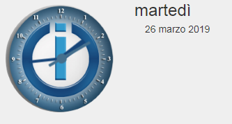
L'orologio non ha una funzione speciale (ma ho fatto uno sforzo) e può essere disattivato in qualsiasi momento nella configurazione.

## Barra Github

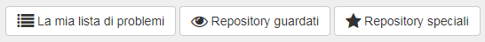
Per vedere questa barra, è necessario prima un account Github e devi specificare un token nella configurazione. Per ulteriori informazioni, vedere in [Descrizione configurazione](#Configurazione) > "GitHub Personal Access Token".

Al momento hai la possibilità di vedere i problemi e i repository auto-creati che sono osservati o contrassegnati con una stella.

Facendo clic su , è possibile visualizzare tutti i commenti sul problema. Il pulsante appare solo se i commenti sono disponibili. Il numero totale di commenti è mostrato nel fumetto prima del titolo del problema.

## Messaggi

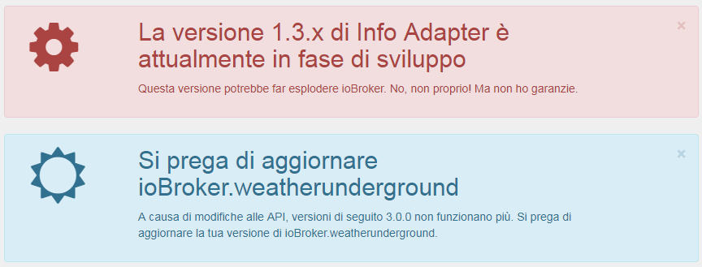
Per inviare rapidamente messaggi importanti riguardanti ioBroker all'utente, è stata creata la possibilità di creare messaggi. Questi messaggi vengono visualizzati SOLO se si verificano determinate condizioni. Quindi nessun messaggio viene visualizzato su un adattatore se non è installato. Ciò garantisce che SOLO gli utenti siano avvisati, anche loro sono interessati dal problema.

I messaggi possono essere chiusi con un clic, nell'angolo in alto a destra di , ma vengono visualizzati nuovamente non appena la scheda di informazioni viene ricaricata, finché il problema persiste.

Per l'uso di messaggi con altri adattatori come Javascript, Telegram, Alexa, ecc., Sono già filtrati nell'oggetto "newsfeed_filtered", memorizzato come una matrice di oggetti.

Esempio:
```javascript
const messages = JSON.parse(getState('info.0.newsfeed_filtered').val);
messages.forEach(message => {
    const title = message.title;
    const text = message.content;
    const created = new Date(message.created);
    console.log(created + " " + title + " " + text);
});
```

### Messaggi (VIS-Widget)


Per i messaggi è stato creato un widget VIS, che appare anche solo se i messaggi riguardano l'utente. Se non ci sono messaggi, non viene visualizzato nulla, quindi non è necessario spazio aggiuntivo sulla superficie VIS per i messaggi, ma semplicemente. nel mezzo dello schermo.

## Documentazione

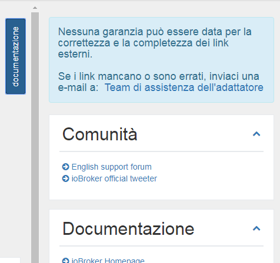
Abbiamo messo insieme un elenco di link importanti. Puoi trovarlo come elenco a discesa facendo clic sul pulsante in alto a destra "Documentazione". Se il pulsante non è visibile, assicurarsi che l'elemento corrispondente nella configurazione sia selezionato.

I singoli collegamenti sono memorizzati in diverse categorie: Comunità, Documentazione, Notizie, Blog, Playlist video, Sviluppo e Altri

Per la correttezza e la completezza dei link esterni non è possibile fornire alcuna garanzia. Se i collegamenti sono mancanti o errati, inviaci una e-mail.

## Aggiornamenti

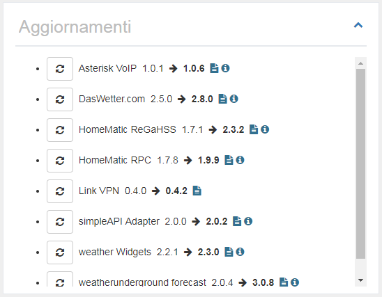
Se vengono rilasciate nuove versioni di un adattatore e anche tu lo hai installato, apparirà in questo elenco.

Da qui puoi aggiornare direttamente con un clic su .
Quando passi il mouse , vedrai i cambiamenti più importanti dal tuo rilascio.
Fare clic su  per visualizzare la descrizione completa dell'adattatore.

Se l'host, ad es. JS-Controller, non è aggiornato, viene visualizzata una casella aggiuntiva sotto "Nuovi adattatori" con il messaggio che è necessario aggiornare l'host.

## Nuovi adattatori

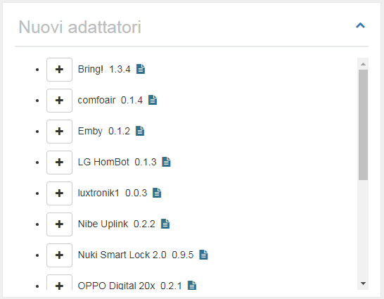
Qui vengono visualizzati tutti gli adattatori nuovi e ufficialmente pubblicati degli ultimi 60 giorni.

Da qui puoi installare direttamente il nuovo adattatore cliccando su .
Fare clic su  per visualizzare la descrizione completa dell'adattatore.

<br>

## Informazioni di sistema


Qui vengono visualizzate le informazioni di sistema del sistema ioBroker. Nel caso di sistemi multi-host, ovviamente, vengono visualizzate anche le informazioni degli altri host. Questi dati provengono dal JS-Controller.

Le seguenti informazioni (per host) sono fornite come informazioni:

- Sistema operativo (linux, win32, darwin, android, aix, freebsd, openbsd o sunos)
- Architettura (arm, arm64, ia32, mips, mipsel, ppc, ppc64, s390, s90x, x32 e x64)
- CPU (numero di core)
- Velocità (velocità del processore)
- Modello (modello di processore)
- RAM (memoria totale approssimativa)
- Tempo di funzionamento del sistema (da quanto tempo è in funzione il sistema)
- Node.js (La versione Node.js - se è una più nuova o la tua versione è obsoleta, anche questa informazione è qui)
- NPM (versione NPM)
- Dimensione del disco rigido (dimensione del disco rigido in cui si trova ioBroker)
- Disco rigido libero (quanto spazio è ancora disponibile)
- numero di adattatori (quanti adattatori sono stati rilasciati finora per ioBroker)
- Tempo di funzionamento (quanto tempo funziona ioBroker senza un riavvio)
- Istanze attive (quante istanze dell'adattatore sono attualmente in esecuzione su questo host)
- nome host (nome dell'host)

```
Se mancano informazioni, è necessario installare una versione recente di JS-Controller.
Questo è il set di dati del JS-Controller v1.5.7.
```

Facendo clic su  vengono visualizzate informazioni dettagliate sul sistema principale.

### Informazioni di sistema (vista dettagliata)

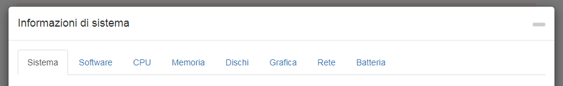

Qui un sacco di informazioni sul sistema di casa viene visualizzato e memorizzato come un oggetto. Questi possono quindi essere utilizzati da te abbastanza comodamente. La maggior parte dei dati viene solo letta e salvata quando l'adattatore viene caricato per la prima volta, poiché questi non cambiano così facilmente.

Alcuni dati vengono aggiornati anche ciclicamente. Quante volte succede questo può essere impostato nella configurazione.

Tieni presente che non tutte le informazioni sono disponibili in tutti i sistemi operativi, il che potrebbe causare la mancata visualizzazione di alcune informazioni.

#### Sistema

Qui vengono visualizzati i dati dell'hardware: scheda madre, BIOS, caso ecc.

#### Software

Il software include dati sul sistema operativo, sul software installato, sui processi in esecuzione e sugli utenti registrati.

#### Processore centrale

Qui puoi trovare tutti i dati relativi alla CPU come velocità, carico e temperatura.

**Problemi con Windows:** wmic è usato per rilevare la temperatura di un sistema Windows. In alcuni casi, wmic deve essere eseguito con i privilegi di amministratore. Quindi, se non ottieni alcun valore, prova a eseguirlo di nuovo con le autorizzazioni appropriate. Se non si ottiene alcun valore, il sistema potrebbe non supportare questa funzione.

**Problemi con Linux:** In alcuni casi è necessario installare il pacchetto del sensore Linux per misurare la temperatura, ad es. sui sistemi basati su DEBIAN eseguendo:

```
$ sudo apt-get install lm-sensors
```

#### Memoria principale

Ecco tutti i dati nella memoria principale come memoria libera o dati nella barra RAM.

#### Hard disk

Tutti i dati su hard disk, partizioni, raid e ROM.

**Problemi con Linux:** Per essere in grado di utilizzare il S.M.A.R.T. Per vedere lo stato di Linux, è necessario installare smartmontools. Sulle distribuzioni Linux basate su DEBIAN, puoi installarlo effettuando le seguenti operazioni:

```
$ sudo apt-get install smartmontools
```

#### Grafico

Qui vengono visualizzati i dati relativi al controller o al monitor, se disponibili / supportati.

#### Rete

Tutti i dati sulle connessioni di rete.

#### Batteria

Tutti i dati sulla batteria, se ne esiste una.

**Problemi con Windows:** wmic viene utilizzato per rilevare lo stato della batteria di un sistema Windows. In alcuni casi, wmic deve essere eseguito con i privilegi di amministratore. Quindi, se non ottieni alcun valore, prova a eseguirlo di nuovo con le autorizzazioni appropriate. Se non si ottiene alcun valore, il sistema potrebbe non supportare questa funzione.

## Richieste di adattatori

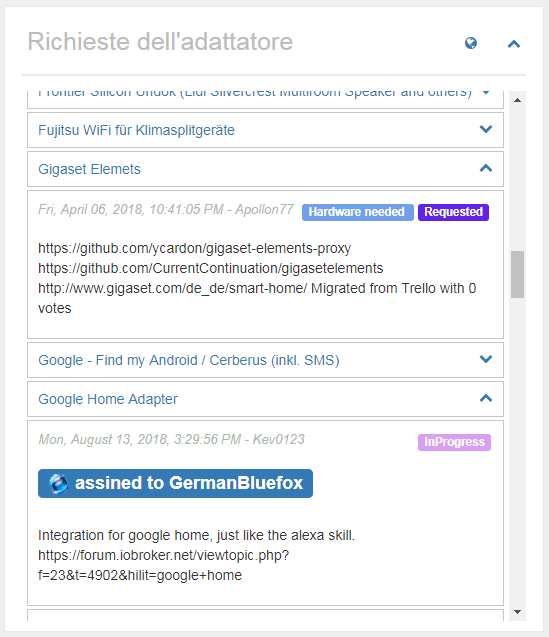
Tutte le richieste dell'adattatore sono state incluse nel github come problema. Chiunque desideri qualcosa, può inserire il suo desiderio qui e chiunque può svilupparlo, può quindi scegliere un problema e sviluppare un adattatore da esso.

In questo elenco verrà visualizzato un titolo e cliccando su , saranno visualizzate informazioni più dettagliate. Sopra i collegamenti quando il desiderio è stato creato, a destra lo stato corrente e sotto una descrizione dettagliata. Se uno sviluppatore ha scelto la richiesta, verrà elencato qui come "assegnato a".

Facendo clic su , si arriva direttamente a Github e si possono aggiungere i propri desideri lì.
Se fai clic sul titolo di un desiderio, atterri direttamente alla richiesta di Github e potresti votare per esso. I desideri con molti voti sono ovviamente preferiti.

Il pannello "Richieste adattatori" può essere nascosto nella configurazione o visualizzato nello stato chiuso durante il caricamento.

### Crea una nuova richiesta di adattatore

Per creare una nuova richiesta, è necessario innanzitutto un account Github e si deve specificare un token nella configurazione. Per ulteriori informazioni, vedere in [Descrizione configurazione](#Configurazione) > "GitHub Personal Access Token".

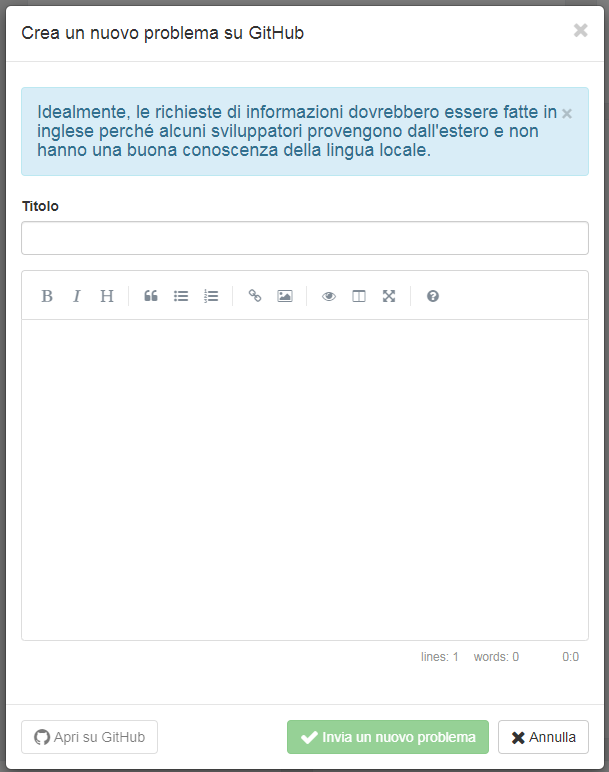
Se si fa clic su , viene visualizzata una finestra in cui è possibile creare un titolo e una descrizione della richiesta dell'adattatore.

Come titolo, seleziona sempre un chiaro e breve termine come "Panasonic TV". Quindi descrivi i tuoi desideri nel modo più accurato possibile.
Se esistono già API conosciute per il prodotto, dovresti scrivere anche questo.
Qualsiasi informazione che possa aiutare lo sviluppatore aumenta la probabilità che l'adattatore corrispondente venga sviluppato rapidamente. Se possibile, si prega di scrivere tutto in inglese,
perché alcuni sviluppatori vengono dall'estero e probabilmente non parlano la tua lingua.

Cliccando su "Invia un nuovo problema", verrà creato un problema su Github. Ora puoi fare clic sul pulsante blu a sinistra per andare direttamente al problema o semplicemente chiudere la finestra.

### Vota per le richieste dell'adattatore

Con un account Github, puoi anche votare direttamente per le richieste dell'adattatore facendo clic . Se funziona, il pulsante diventa verde. Tutti possono votare solo un voto. Il numero totale di voci è visualizzato nell'oggetto davanti al titolo.

Nella panoramica, le richieste dell'adattatore che hai votato sono visualizzate in verde e le richieste inferiori a 1 mese sono blu.

## I miei adattatori

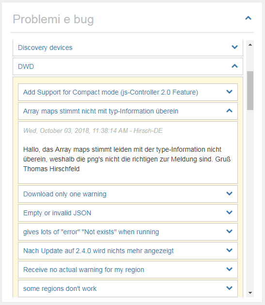
Ovviamente, nessun adattatore è privo di errori e alcuni utenti potrebbero avere anche idee di espansione. Tutto ciò che è noto sugli adattatori installati è raccolto qui. Puoi anche usare questo elenco per scoprire se un bug appena trovato è noto anche allo sviluppatore, perché solo i bug conosciuti possono essere corretti.

Fare clic su , a destra del nome dell'adattatore, aprirà l'elenco di problemi / richieste noti. Questi possono anche essere aperti, dove troverai una descrizione dettagliata.

Se fai clic sul nome dell'adattatore, puoi andare direttamente alla lista Problemi su Github e puoi eventualmente inserire un nuovo errore o desideri espandere.
Se fai clic sul titolo di un problema, finisci direttamente con il messaggio su Github e puoi facoltativamente fornire allo sviluppatore maggiori informazioni, lasciare un commento.
Facendo clic su , è possibile visualizzare tutti i commenti sul problema. Il pulsante appare solo se i commenti sono disponibili. Il numero totale di commenti è mostrato nel fumetto prima del titolo del problema.

Il pannello "Problemi ed errori" può essere nascosto nella configurazione o visualizzato nello stato chiuso durante il caricamento.

### Segnala desideri o errori

Se apri un adattatore, hai la possibilità di segnalare un nuovo errore o dare suggerimenti per miglioramenti facendo clic su 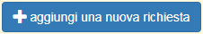. Ciò richiede un account Github e un token nella configurazione. Ulteriori dettagli sono disponibili in [Descrizione configurazione](#Configurazione) > "GitHub Personal Access Token".

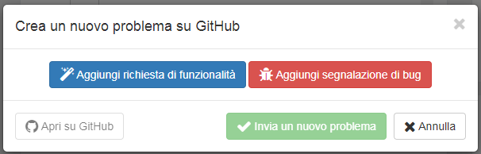
Quando si fa clic si ottiene l'opportunità di presentare una proposta di miglioramento (blu) o segnalare un errore (rosso). Entrambe le opzioni ti consentono di inserire un titolo e una descrizione.

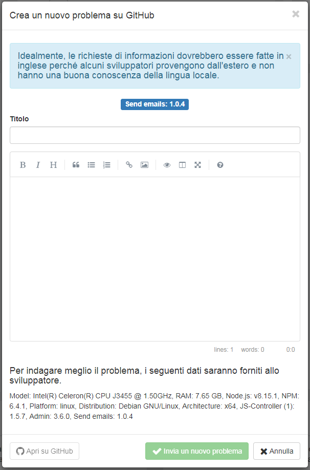
Il titolo dovrebbe darti una descrizione chiara e concisa del problema. Quando descrivi, non dovresti essere frugale con le informazioni. Ogni dettaglio può aiutare lo sviluppatore ad implementare il problema o desiderare più velocemente. Se possibile, si prega di scrivere tutto in inglese, perché alcuni sviluppatori vengono dall'estero e probabilmente non parlano la tua lingua.

Facendo clic su "Invia nuovo numero", verrà creato un problema su Github. Ora puoi fare clic sul pulsante blu a sinistra per andare direttamente al problema o semplicemente chiudere la finestra.

### Contrassegna l'adattatore come preferito

Gli sviluppatori sacrificano molto tempo libero per sviluppare adattatori per te. Ecco la tua occasione, a condizione che sia stato inserito un Guthub Token, cliccando su  per ringraziare gli sviluppatori per il loro lavoro. Tutti possono votare solo un voto. Il numero totale di voti sarà mostrato nell'oggetto prima del titolo.

Nella panoramica, gli adattatori che sono stati preferiti da te sono visualizzati in verde.

## adattatore ioBroker su Github

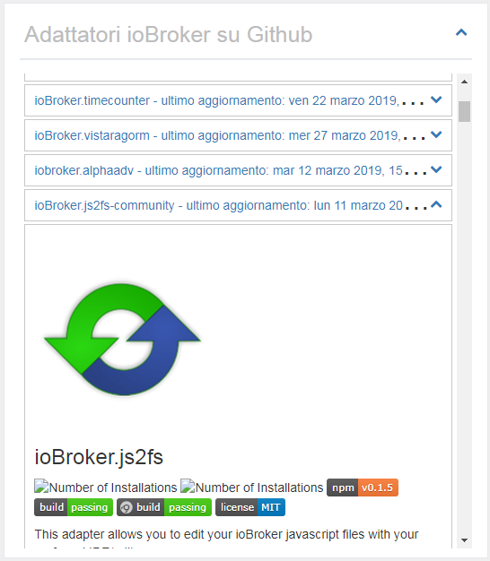
Il numero di adattatori ufficiali per ioBroker è già considerevole. Naturalmente, ci sono molti altri adattatori disponibili in rete. Questi sono cercati e visualizzati qui.

Se apri il pannello con un clic su , qui viene visualizzata la descrizione completa dell'adattatore.

Il pannello "ioBroker su Github" può essere nascosto nella configurazione o visualizzato nello stato chiuso durante il caricamento. È inoltre possibile regolare l'ordine di ordinamento.

```
ATTENTO!!! Questi adattatori potrebbero trovarsi in una fase iniziale di sviluppo.
Questi non dovrebbero essere installati su un sistema di produzione.
Ogni installazione è a vostro rischio e pericolo!
```

## Notizia

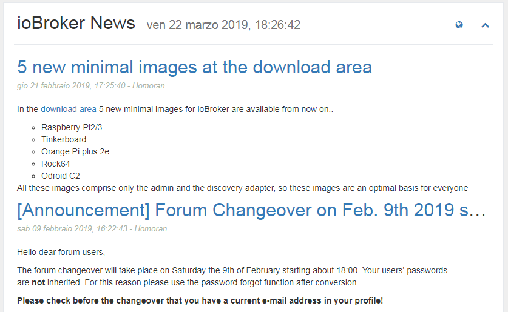
Di tanto in tanto, verranno pubblicate le notizie ufficiali del team ioBroker. Qui saranno visualizzati.

Clicca su  per accedere direttamente alla pagina ioBroker ufficiale.

Le notizie vengono visualizzate senza problemi quando si accede a ioBroker tramite IP o localhost: 8081. Ma se usi un hostname come meinhaus.de:8081, devi ottenere una chiave API gratuita su Feednami. Per registrarsi, fare clic su [qui](https://toolkit.sekando.com/docs/en/setup/hostnames) e seguire le istruzioni.

## Forum

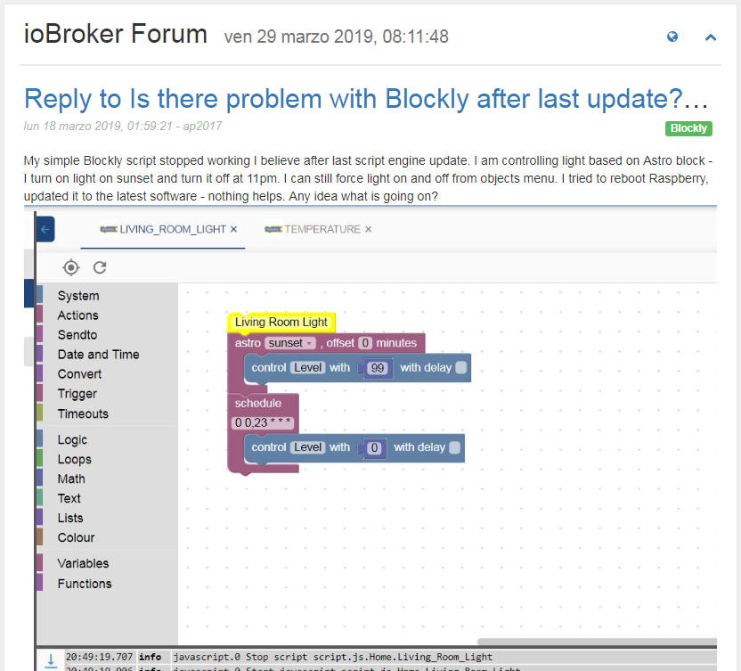
Qui le ultime voci del forum sono visualizzate nella lingua selezionata. Se non ci sono forum nella lingua, i dati verranno visualizzati sul forum inglese.

Clicca su  per accedere direttamente al forum.

Le voci del forum verranno visualizzate senza problemi quando si accede a ioBroker tramite IP o localhost: 8081. Ma se usi un hostname come meinhaus.de:8081, devi ottenere una chiave API gratuita su Feednami. Per registrarsi, fare clic su [qui](https://toolkit.sekando.com/docs/en/setup/hostnames) e seguire le istruzioni.