# Beheerder

De Info Adapter is ontwikkeld om verschillende informatie over het systeem, over ioBroker en relevante onderwerpen aan de gebruiker te verstrekken. De gebruiker moet een overzicht krijgen van alle interessante en belangrijke gegevens en het ioBroker-team krijgt de mogelijkheid om nog sneller contact op te nemen met de gebruiker, indien belangrijke informatie beschikbaar is.

# Installatie

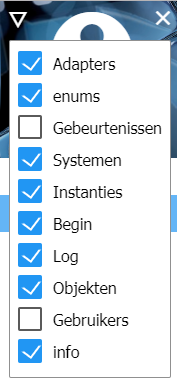
Om het informatievenster op het tabblad Tabblad te zien, moet u het na installatie eerst controleren als Zichtbaar in de beheerder. Om dit te doen, klikt u op het driehoekje links in de linkerbovenhoek van het Admin-venster en selecteert u 'Info' in het menu.

# Configuratie

<p align="center">
    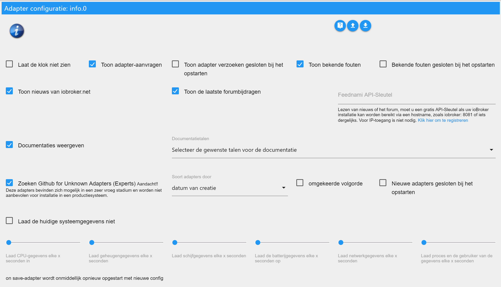
</p>

* **Laat de klok niet zien** - om de klok bovenaan links te verbergen.
* **Evenementen verbergen (alleen duits)** - Evenementkalender wordt niet weergegeven
* **Adapteraanvragen weergeven** - Geeft het paneel weer met de adapteraanvragen.
    * **Adapterverzoeken gesloten bij opstarten** - Het paneel met de adapteraanvragen wordt gesloten wanneer het Info-venster wordt gestart.
* **Bekijk bekende fouten** - Geeft het paneel met bekende fouten en verzoeken voor geïnstalleerde adapters weer.
    * **Bekende fouten bij het opstarten gesloten** - Het paneel met de bekende fouten is gesloten bij het starten van het informatievenster.

* **Nieuws tonen van iobroker.net** - Geeft het paneel met het officiële nieuws van ioBroker weer.
* **Toon de laatste forumbijdragen** - Geeft het paneel met de laatste forumvermeldingen weer.
* **Feednami API Key** - Als u ioBroker belt met een hostnaam, zoals iobroker: 8081 of iets dergelijks, moet u zich gratis aanmelden bij Feednami om een ​​geschikte API-sleutel te krijgen. Dit is niet nodig voor toegang via een IP-adres.

* **Documentatie weergeven** - Geeft de knop voor de documentatie weer.
    * **Selecteer de gewenste talen voor de documentatie** - Selectie van de talen die in de documentatie moeten worden opgenomen. (Mogelijk moet u op de naam rechts klikken om te selecteren wat - standaard -> taal instellen + engels)

* **Github zoeken naar onbekende adapters (Experts)** - Geeft het paneel weer dat naar niet-goedgekeurde adapters zoekt in de github.
    * **Sorteeradapter op** - Sorteert het resultaat van de zoekopdracht op naam, aanmaakdatum of laatste update.
    * **omgekeerde volgorde** - keert de volgorde van de resultaten om.
    * **Nieuwe adapters gesloten bij opstarten** - Het paneel met de onbekende adapters is gesloten bij het starten van het informatievenster.

* **GitHub persoonlijke toegangstoken** - Om rechtstreeks vanuit ioBroker nieuwe problemen of adapterverzoeken op Github te kunnen maken, hebt u een token nodig dat daar kan worden gegenereerd. Dit vereist een Github-account.
Om het token te krijgen, meldt u zich aan bij Github, klik op het gebruikerspictogram in de rechterbovenhoek, ga naar "Settings" en vervolgens "Developer settings"> "Personal access tokens". Daar, klik op "Generate new token", typ een willekeurige naam onder "Token description" en selecteer als "Scope", "repo". Vervolgens krijg je een token en voer je het in in de ioBroker. U vindt meer gedetailleerde instructies in het Engels [hier](https://help.github.com/en/articles/creating-a-personal-access-token-for-the-command-line).


* **Laad geen systeemgegevens** - de huidige systeemgegevens zijn niet cyclisch geladen.
    * **Laad CPU-gegevens elke x seconden** - De CPU-gegevens worden cyclisch elke 1 tot 10 seconden geladen. (0 is uitgeschakeld - standaard 3)
    * **Geheugengegevens elke x seconden laden** - De geheugengegevens worden cyclisch elke 1 tot 10 seconden geladen. (0 is uitgeschakeld - standaard 3)
    * **Schijfgegevens elke x seconden laden** - De gegevens op de harde schijf worden cyclisch elke 1 tot 10 seconden geladen. (0 is uitgeschakeld - standaard 8)
    * **Laad de batterij elke x seconden in** - laad de batterijgegevens cyclisch elke 1 tot 10 seconden. (0 is uitgeschakeld - standaard 8)
    * **Laad netwerkgegevens elke x seconden** - Laad netwerkgegevens cyclisch elke 1 tot 10 seconden. (0 is uitgeschakeld - standaard 3)
    * **Laadproces en gebruikersgegevens elke x seconden** - Proces- en gebruikersgegevens worden cyclisch elke 1 tot 10 seconden geladen. (0 is uitgeschakeld - standaard 8)

Bij een Windows-systeem zou het cyclisch laden van de systeemgegevens niet te snel moeten gebeuren, omdat dit een aanzienlijke belasting van het systeem veroorzaakt. De standaardwaarden zijn geselecteerd om zonder problemen op de meeste systemen te worden uitgevoerd.

# Info-tabblad

Het tabblad Info bevat verschillende informatie over uw systeem en de ioBroker. Het tabblad is onderverdeeld in verschillende blokken die kunnen worden aangepast. Bijna alle blokken kunnen worden geopend of geopend met één klik .

## Klok

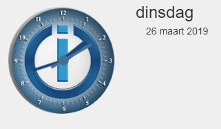
De klok heeft geen speciale functie (maar ik heb me ingespannen) en kan op elk moment in de configuratie worden uitgeschakeld.

## Github-balk


Om deze balk te zien, hebt u eerst een Github-account nodig en moet u een token in de configuratie opgeven. Zie voor meer informatie onder [Configuratiebeschrijving](#Configuratie) > "GitHub Personal Access Token".

Op dit moment heb je de mogelijkheid om zelf gecreëerde problemen en repositories te zien die worden waargenomen of gemarkeerd met een ster.

Door te klikken op , kunnen alle opmerkingen over het probleem worden getoond. De knop verschijnt alleen als er opmerkingen beschikbaar zijn. Het totale aantal opmerkingen wordt weergegeven in de ballon vóór de titel van het probleem.

## Berichten

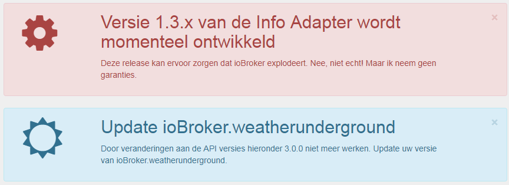
Om snel belangrijke berichten over ioBroker naar de gebruiker te verzenden, is de mogelijkheid gecreëerd om berichten te maken. Deze berichten verschijnen ALLEEN als bepaalde voorwaarden van toepassing zijn. Er worden dus geen berichten weergegeven over een adapter als deze niet is geïnstalleerd. Dit zorgt ervoor dat ALLEEN de gebruikers worden gewaarschuwd, die ook door het probleem worden getroffen.

De berichten kunnen met één klik worden gesloten, in de rechterbovenhoek van , maar ze verschijnen opnieuw zodra de infotab opnieuw is geladen, zolang het probleem aanhoudt.

Voor het gebruik van berichten met andere adapters, zoals Javascript, Telegram, Alexa, enz., Zijn ze al gefilterd in het object "newsfeed_filtered", opgeslagen als een array van objecten.

Voorbeeld:
```javascript
const messages = JSON.parse(getState('info.0.newsfeed_filtered').val);
messages.forEach(message => {
    const title = message.title;
    const text = message.content;
    const created = new Date(message.created);
    console.log(created + " " + title + " " + text);
});
```

### Berichten (VIS-Widget)


Voor de berichten is een VIS-widget gemaakt, die ook alleen wordt weergegeven als de berichten betrekking hebben op de gebruiker. Als er geen berichten zijn, wordt er niets weergegeven, dus u hoeft geen extra ruimte op het VIS-oppervlak te hebben voor de berichten, maar eenvoudigweg. in het midden van het scherm.

## Documentatie

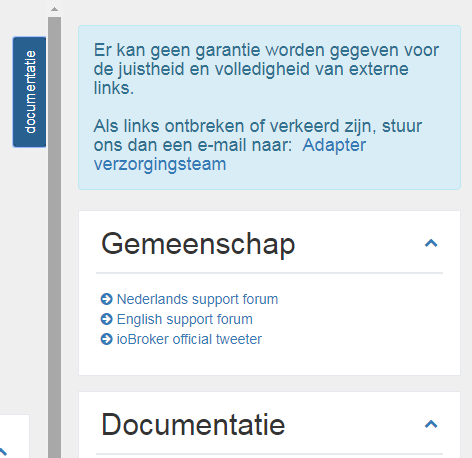
We hebben een lijst met belangrijke links samengesteld. Je kunt dit als een vervolgkeuzelijst vinden door op de knop rechtsboven "Documentatie" te klikken. Als de knop niet zichtbaar is, controleer dan of het overeenkomstige item in de configuratie is geselecteerd.

De individuele links worden opgeslagen in verschillende categorieën: Community, Documentatie, Nieuws, Blog, Videoplaylist, Ontwikkeling en Overige

Voor de juistheid en volledigheid van externe links kan geen garantie worden gegeven. Als links ontbreken of niet kloppen, stuur ons dan een e-mail.

## Updates

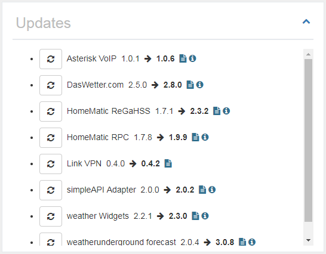
Als er nieuwe versies van een adapter worden uitgebracht en u deze ook hebt geïnstalleerd, verschijnt deze in deze lijst.

Vanaf hier kunt u direct updaten met een klik op .
Wanneer u met de muisaanwijzer  gaat, ziet u de belangrijkste wijzigingen sinds uw release.
Klik op  om de volledige beschrijving van de adapter weer te geven.

Als de host, oftewel JS-controller, is verouderd, verschijnt er een extra vak onder 'Nieuwe adapters' met het bericht dat u de host moet bijwerken.

## Nieuwe adapters

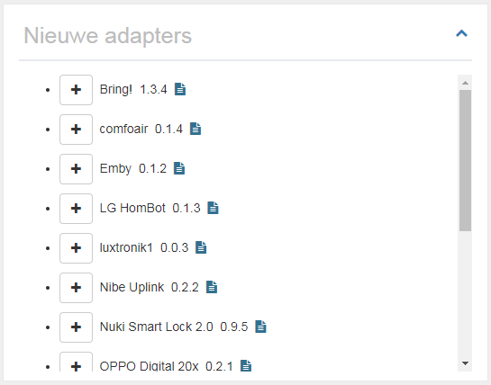
Hier worden alle nieuwe en officieel vrijgegeven adapters van de afgelopen 60 dagen weergegeven.

Vanaf hier kunt u de nieuwe adapter direct installeren door op  te klikken.
Klik op  om de volledige beschrijving van de adapter weer te geven.

<br>

## Systeem informatie

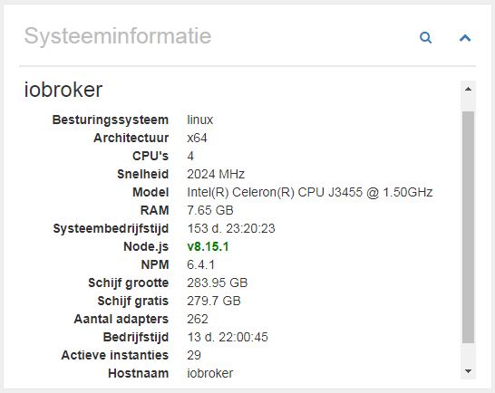
De systeeminformatie van het ioBroker-systeem wordt hier weergegeven. In het geval van multi-host-systemen wordt natuurlijk ook de informatie van de andere hosts weergegeven. Deze gegevens komen van de js-controller.

De volgende informatie (per host) wordt gegeven als info:

- Besturingssysteem (linux, win32, darwin, android, aix, freebsd, openbsd of sunos)
- Architectuur (arm, arm64, ia32, mips, mipsel, ppc, ppc64, s390, s90x, x32 en x64)
- CPU's (aantal kernen)
- Snelheid (processorsnelheid)
- Model (processormodel)
- RAM (bij benadering totaal geheugen)
- Werkingstijd systeem (hoe lang heeft het systeem gedraaid)
- Node.js (De Node.js-versie - als deze nieuwer is of uw versie is verouderd, deze informatie staat hier ook)
- NPM (NPM-versie)
- Hardeschijfgrootte (grootte van de harde schijf waar ioBroker zich bevindt)
- Vaste schijf vrij (hoeveel ruimte is nog beschikbaar)
- aantal adapters (hoeveel adapters zijn tot nu toe vrijgegeven voor ioBroker)
- Gebruikstijd (hoelang duurt de ioBroker zonder een herstart)
- Actieve exemplaren (hoeveel adapter-instanties worden momenteel uitgevoerd op deze host)
- hostnaam (naam van de host)

```
Als er informatie ontbreekt, moet een recente versie van de JS-controller worden geïnstalleerd.
Dit is de dataset van de JS-Controller v1.5.7.
```

Als u op klikt , wordt gedetailleerde informatie over het hoofdsysteem weergegeven.

### Systeeminformatie (gedetailleerde weergave)

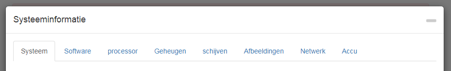

Hier wordt veel informatie over het huissysteem weergegeven en opgeslagen als een object. Deze kunnen dan door u heel comfortabel worden gebruikt. De meeste gegevens worden alleen gelezen en opgeslagen wanneer de adapter voor het eerst wordt opgeladen, omdat deze niet zo gemakkelijk veranderen.

Sommige gegevens worden ook cyclisch bijgewerkt. Hoe vaak dit gebeurt, kan worden ingesteld in de configuratie.

Houd er rekening mee dat niet alle informatie beschikbaar is in elk besturingssysteem, wat ertoe kan leiden dat bepaalde informatie niet wordt weergegeven.

#### Systeem

Hier worden de hardwaregegevens weergegeven - moederbord, bios, case enz ...

#### Software

Software bevat gegevens over het besturingssysteem, geïnstalleerde software, actieve processen en ingelogde gebruikers.

#### Centrale processor

Hier kunt u gegevens vinden over de CPU, zoals snelheid, belasting en temperatuur.

**Problemen met Windows:** wmic wordt gebruikt om de temperatuur van een Windows-systeem te detecteren. In sommige gevallen moet wmic worden uitgevoerd met beheerdersbevoegdheden. Dus als u geen waarden krijgt, probeer het dan opnieuw met de juiste rechten. Als u nog steeds geen waarden ontvangt, ondersteunt uw systeem deze functie mogelijk niet.

**Problemen met Linux:** In sommige gevallen moet u het Linux-sensorpakket installeren om de temperatuur te meten, bijvoorbeeld op DEBIAN-gebaseerde systemen door te draaien:

```
$ sudo apt-get install lm-sensors
```

#### Hoofd geheugen

Hier zijn alle gegevens naar het hoofdgeheugen zoals gratis geheugen of gegevens naar de RAM-balk.

#### Harde schijven

Alle gegevens op harde schijven, partities, raids en ROM's.

**Problemen met Linux:** Om de S.M.A.R.T. te kunnen gebruiken. Om de Linux-status te zien, moet je de smartmontools installeren. Op DEBIAN-gebaseerde Linux-distributies, kunt u het als volgt installeren:

```
$ sudo apt-get install smartmontools
```

#### Grafisch

Gegevens over de controller of monitor worden hier weergegeven, indien beschikbaar / ondersteund.

#### Netwerk

Alle gegevens over de netwerkverbindingen.

#### Accu

Alle gegevens over de batterij, indien aanwezig.

**Problemen met Windows:** wmic wordt gebruikt om de batterijstatus van een Windows-systeem te detecteren. In sommige gevallen moet wmic worden uitgevoerd met beheerdersbevoegdheden. Dus als u geen waarden krijgt, probeer het dan opnieuw met de juiste rechten. Als u nog steeds geen waarden ontvangt, ondersteunt uw systeem deze functie mogelijk niet.

## Adapterverzoeken

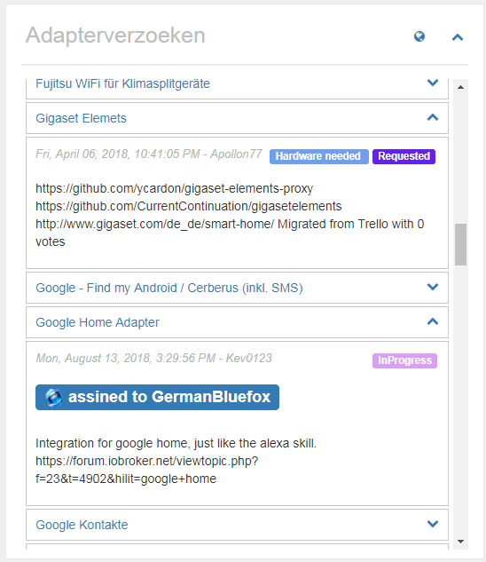
Alle adapterverzoeken waren als een probleem opgenomen in de github. Iedereen die iets wil, kan zijn wens hier invoeren en iedereen kan zich ontwikkelen, kan dan een probleem kiezen en er een adapter uit ontwikkelen.

In deze lijst wordt een titel weergegeven en door te klikken op , is meer gedetailleerde informatie zichtbaar. Bovenstaande links wanneer de wens is gemaakt, rechts de huidige status en hieronder een gedetailleerde beschrijving. Als een ontwikkelaar het verzoek heeft gekozen, wordt dit hier weergegeven als 'assined to'.

Door te klikken op , kom je rechtstreeks bij Github en kun je daar je eigen wensen toevoegen.
Als je op de titel van een wens klikt, beland je rechtstreeks op verzoek van Github en stem je ervoor. Wensen met veel stemmen hebben natuurlijk de voorkeur.

Het paneel "Adapteraanvragen" kan tijdens het laden worden verborgen in de configuratie of worden weergegeven in de gesloten toestand.

### Nieuwe adapteraanvraag maken

Om een ​​nieuw verzoek aan te maken, hebt u eerst een Github-account nodig en moet u een token in de configuratie opgeven. Zie voor meer informatie onder [Configuratiebeschrijving] (# Configuratie)> "GitHub Personal Access Token".

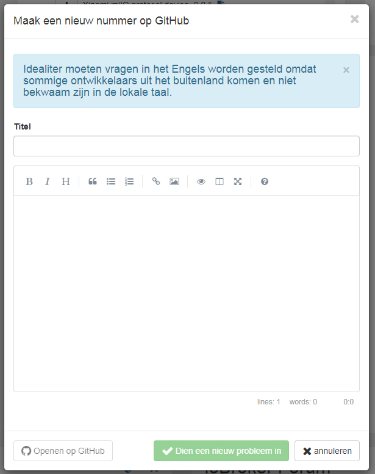
Als u op  klikt, verschijnt een venster waarin u de mogelijkheid hebt om een ​​titel en een beschrijving van de adapteraanvraag te maken.

Kies als titel altijd een duidelijke en korte termijn zoals "Panasonic TV". Beschrijf vervolgens uw wensen zo nauwkeurig mogelijk.
Als er al bekende API's voor het product bestaan, moet u dit ook schrijven.
Alle informatie die de ontwikkelaar kan helpen, vergroot de kans dat de bijbehorende adapter snel wordt ontwikkeld. Schrijf indien mogelijk alles in het Engels,
omdat sommige ontwikkelaars uit het buitenland komen en waarschijnlijk niet jouw taal spreken.

Door op "Dien een nieuw probleem in" te klikken, wordt er een probleem aangemaakt op Github. Nu kunt u op de blauwe knop aan de linkerkant klikken om direct naar het probleem te gaan of gewoon het venster sluiten.

### Stem op adapterverzoeken

Met een Github-account kunt u ook direct op adapterverzoeken stemmen door te klikken . Als het werkt, wordt de knop groen. Iedereen kan maar één stem uitbrengen. Het totale aantal stemmen wordt weergegeven in het object vóór de titel.

In het overzicht worden adapterverzoeken waarvoor u hebt gestemd in groen weergegeven en aanvragen die jonger zijn dan 1 maand zijn blauw.

## Mijn adapters

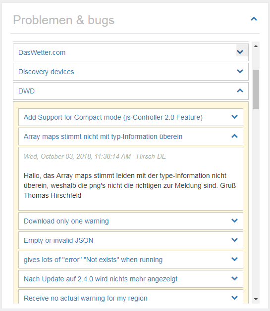
Natuurlijk zijn geen adapters foutloos en sommige gebruikers hebben ook ideeën voor uitbreiding. Alles wat bekend is over de geïnstalleerde adapters wordt hier verzameld. Je kunt deze lijst ook gebruiken om te achterhalen of een bug die je net hebt gevonden ook bekend is bij de ontwikkelaar, omdat alleen bekende bugs kunnen worden opgelost.

Klik op , rechts van de naam van de adapter, opent de lijst met bekende problemen / verzoeken. Deze kunnen ook worden geopend, waar u dan een gedetailleerde beschrijving zult vinden.

Als u op de naam van de adapter klikt, kunt u rechtstreeks naar de lijst met problemen op Github gaan en mogelijk een nieuwe fout invoeren of uitbreiden.
Als u op de titel van een probleem klikt, komt u rechtstreeks met het bericht op Github en kunt u de ontwikkelaar desgewenst meer informatie geven, als commentaar achterlaten.
Door te klikken op , kunnen alle opmerkingen over het probleem worden getoond. De knop verschijnt alleen als er opmerkingen beschikbaar zijn. Het totale aantal opmerkingen wordt weergegeven in de ballon vóór de titel van het probleem.

Het venster "Problemen en fouten" kan worden verborgen in de configuratie of in gesloten toestand worden weergegeven tijdens het laden.

### Meld wensen of fouten

Als u een adapter opent, kunt u een nieuwe fout melden of suggesties doen voor verbeteringen door te klikken op 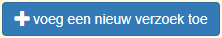. Dit vereist een Github-account en een token in de configuratie. Verdere details vindt u onder [Configuratiebeschrijving](#Configuratie) > "GitHub Personal Access Token".

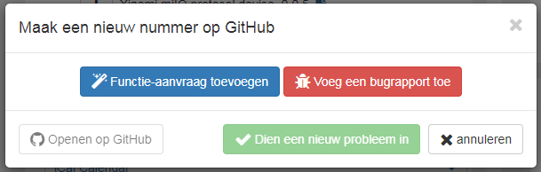
Wanneer u klikt, krijgt u de mogelijkheid om een ​​verbeteringsvoorstel in te dienen (blauw) of een fout te melden (rood). Met beide opties kunt u een titel en een beschrijving invoeren.

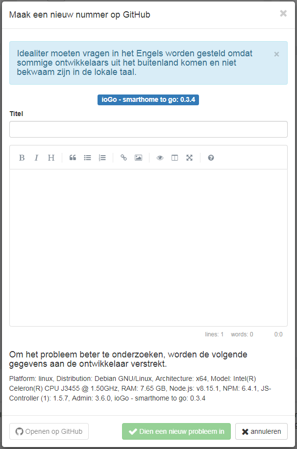
De titel zou u een duidelijke en beknopte beschrijving van het probleem moeten geven. Beschrijf bij het beschrijven niet zuinig met informatie. Elk detail kan de ontwikkelaar helpen het probleem of de wens sneller uit te voeren. Schrijf indien mogelijk alles in het Engels,
omdat sommige ontwikkelaars uit het buitenland komen en waarschijnlijk uw taal niet spreken.

Door op "Nieuw probleem verzenden" te klikken, wordt er een probleem aangemaakt op Github. Nu kunt u op de blauwe knop aan de linkerkant klikken om direct naar het probleem te gaan of gewoon het venster sluiten.

### Markeer adapter als favoriet

Ontwikkelaars offeren veel vrije tijd op om adapters voor u te ontwikkelen. Dit is je kans, op voorwaarde dat je een Guthub-token hebt ingevoerd, door op te klikken  om de ontwikkelaars te bedanken voor hun werk. Iedereen kan maar één stem uitbrengen. Het totale aantal stemmen wordt weergegeven in het object vóór de titel.

In het overzicht worden adapters die door u zijn begunstigd in het groen weergegeven.

## ioBroker-adapter op Github

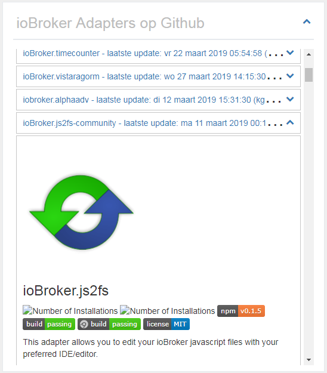
Het aantal officiële adapters voor ioBroker is al aanzienlijk. Natuurlijk zijn er veel meer adapters beschikbaar op het net. Deze worden hier doorzocht en weergegeven.

Als u het paneel opent met een klik op , wordt hier de volledige beschrijving van de adapter weergegeven.

Het "ioBroker-adapter op Github" -paneel kan worden verborgen in de configuratie of in gesloten toestand worden weergegeven tijdens het laden. U kunt ook de volgorde van sorteren aanpassen.

```
KIJK UIT!!! Deze adapters bevinden zich mogelijk nog in een zeer vroeg stadium van ontwikkeling.
Deze mogen niet op een productiesysteem worden geïnstalleerd.
Elke installatie is op eigen risico!
```

## Nieuws

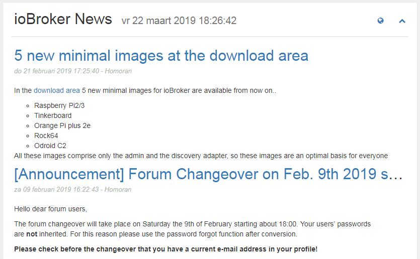
Af en toe wordt officieel nieuws van het ioBroker-team gepubliceerd. Hier worden ze weergegeven.

Klik op  om direct naar de officiële ioBroker-pagina te gaan.

Het nieuws wordt zonder problemen weergegeven bij toegang tot ioBroker via IP of localhost:8081. Maar als u een hostnaam zoals meinhaus.de:8081 gebruikt, moet u een gratis API-sleutel krijgen bij Feednami. Om te registreren, klik [hier](https://toolkit.sekando.com/docs/en/setup/hostnames) en volg de instructies.

## Forum

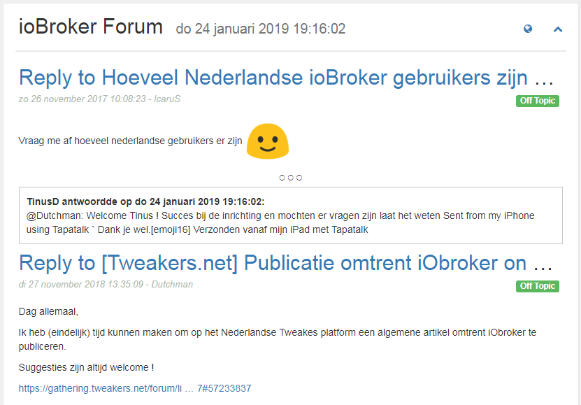
Hier worden de laatste vermeldingen van het forum in de geselecteerde taal weergegeven. Als er geen forum in de taal is, worden de gegevens weergegeven op het Engelse forum.

Klik op  om direct naar het forum te gaan.

Forum-vermeldingen worden zonder problemen weergegeven wanneer ioBroker wordt benaderd via IP of localhost:8081. Maar als u een hostnaam zoals meinhaus.de:8081 gebruikt, moet u een gratis API-sleutel krijgen bij Feednami. Om te registreren, klik [hier](https://toolkit.sekando.com/docs/en/setup/hostnames) en volg de instructies.