# Administrator

Adapter informacyjny został opracowany w celu dostarczenia użytkownikowi różnych informacji o systemie, o ioBroker i odpowiednich tematach. Użytkownik powinien uzyskać przegląd wszystkich interesujących i ważnych danych, a zespół ioBroker będzie miał możliwość szybszego skontaktowania się z użytkownikiem, jeśli dostępne będą ważne informacje.

# Instalacja

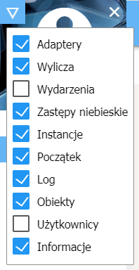
Aby zobaczyć okno informacyjne w zakładce Tab, musisz najpierw sprawdzić, czy jest widoczne w Adminie po instalacji. Aby to zrobić, kliknij lewy trójkąt w lewym górnym rogu okna administratora i wybierz „Info” w menu.

# Konfiguracja

<p align="center">
    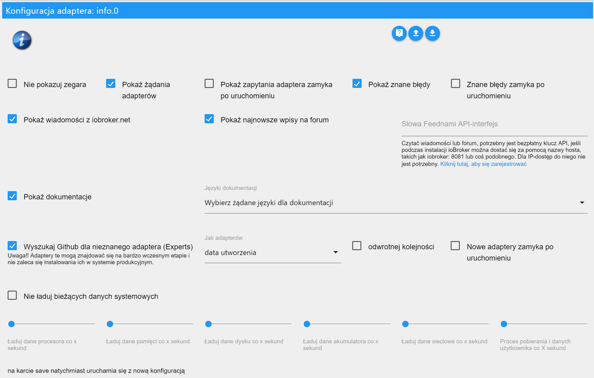
</p>

* **Nie pokazuj zegara** - Aby ukryć zegar w lewym górnym rogu.
* **Ukryj wydarzenia (tylko niemiecki)** - Kalendarz wydarzeń nie jest wyświetlany
* **Pokaż żądania adaptera** - Wyświetla panel z żądaniami adaptera.
    * **Żądania adaptera zamknięte przy starcie** - Panel z żądaniami adaptera jest zamykany, gdy uruchamia się okno informacyjne.
* **Wyświetl znane błędy** - Wyświetla panel ze znanymi błędami i żądaniami zainstalowanych kart.
    * **Znane błędy przy zamkniętym starcie** - Panel ze znanymi błędami jest zamykany podczas uruchamiania okna informacyjnego.

* **Pokaż wiadomości z iobroker.net** - Wyświetla panel z oficjalnymi wiadomościami ioBroker.
* **Pokaż najnowsze wpisy na forum** - Wyświetla panel z ostatnimi wpisami na forum.
* **Klucz API Feednami** - Jeśli zadzwonisz do ioBroker przy użyciu nazwy hosta, takiej jak iobroker: 8081 lub coś takiego, musisz zarejestrować się za darmo w Feednami, aby uzyskać odpowiedni klucz API. Nie jest to konieczne do uzyskania dostępu przez adres IP.

* **Pokaż dokumentację** - Wyświetla przycisk do dokumentacji.
    * **Wybierz wymagane języki dla dokumentacji** - Wybór języków do uwzględnienia w dokumentacji. (Może być konieczne kliknięcie nazwy po prawej stronie, aby wybrać - domyślnie -> ustaw język + angielski)

* **Wyszukaj Github dla nieznanych adapterów (Eksperci)** - Wyświetla panel wyszukiwania niezatwierdzonych adapterów w githubie.
    * **Sort Adapter by** - Sortuje wynik wyszukiwania według nazwy, daty utworzenia lub ostatniej aktualizacji.
    * **odwrotna kolejność** - odwraca kolejność wyników.
    * **Nowe adaptery zamknięte przy starcie** - Panel z nieznanymi kartami jest zamknięty podczas uruchamiania okna informacyjnego.

* **Token osobistego dostępu GitHub** - Aby móc tworzyć nowe problemy lub żądania adapterów w Github bezpośrednio z ioBroker, potrzebujesz tokena, który można tam wygenerować. Wymaga to konta Github.
Aby zdobyć token, zaloguj się do Github, kliknij ikonę użytkownika w prawym górnym rogu, przejdź do „Settings”, a następnie „Developer settings”> „Personal access tokens”. Kliknij „Generate new token”, wpisz dowolną nazwę pod „Token description” i wybierz „Scope”, „repo”. Następnie otrzymujesz token i wpisujesz go w ioBroker. Bardziej szczegółowe instrukcje można znaleźć w języku angielskim [tutaj](https://help.github.com/en/articles/creating-a-personal-access-token-for-the-commandline).
 

* **Nie ładuj bieżących danych systemowych** - Aktualne dane systemowe nie są ładowane cyklicznie.
    * **Ładuj dane procesora co x sekund** - Dane procesora są ładowane cyklicznie co 1 do 10 sekund. (0 jest wyłączone - domyślnie 3)
    * **Dane pamięci ładowania co x sekund** - Dane pamięci są ładowane cyklicznie co 1 do 10 sekund. (0 jest wyłączone - domyślnie 3)
    * **Ładuj dane dysku co x sekund** - Dane dysku twardego są ładowane cyklicznie co 1 do 10 sekund. (0 jest wyłączone - domyślnie 8)
    * **Ładuj dane akumulatora co x sekund** - Ładuj dane akumulatora cyklicznie co 1 do 10 sekund. (0 jest wyłączone - domyślnie 8)
    * **Ładuj dane sieciowe co x sekund** - Ładuj dane sieciowe cyklicznie co 1 do 10 sekund. (0 jest wyłączone - domyślnie 3)
    * **Proces ładowania i dane użytkownika co x sekund** - Dane procesowe i użytkownika są ładowane cyklicznie co 1 do 10 sekund. (0 jest wyłączone - domyślnie 8)

W systemie Windows cykliczne ładowanie danych systemowych nie powinno odbywać się zbyt szybko, ponieważ powoduje to znaczne obciążenie systemu. Domyślne wartości zostały wybrane do uruchamiania bez problemów w większości systemów.

# Zakładka Info

Zakładka Info zawiera różne informacje o systemie i ioBroker. Karta jest podzielona na różne bloki, które można dostosować. Prawie wszystkie bloki można otworzyć lub otworzyć jednym kliknięciem .

## Zegar

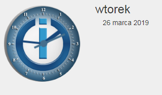
Zegar nie ma specjalnej funkcji (ale zrobiłem wysiłek) i można go wyłączyć w dowolnym momencie konfiguracji.

## Pasek Github

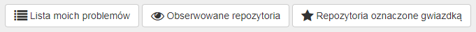
Aby zobaczyć ten pasek, najpierw potrzebujesz konta Github i musisz określić token w konfiguracji. Aby uzyskać więcej informacji, zobacz [Opis konfiguracji](#Konfiguracja) > „Token osobistego dostępu GitHub”.

W tej chwili masz możliwość zobaczenia samodzielnie utworzonych problemów i repozytoriów, które są obserwowane lub oznaczone gwiazdką.

Klikając , można wyświetlić wszystkie komentarze dotyczące problemu. Przycisk pojawia się tylko wtedy, gdy dostępne są komentarze. Łączna liczba komentarzy jest wyświetlana w dymku przed tytułem problemu.

## Wiadomości

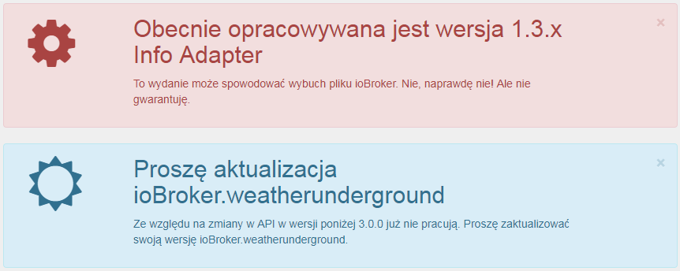
Aby szybko wysłać ważne wiadomości dotyczące ioBroker do użytkownika, stworzono możliwość tworzenia wiadomości. Komunikaty te pojawiają się TYLKO, jeśli mają zastosowanie określone warunki. Tak więc żadne komunikaty nie są wyświetlane na adapterze, jeśli nie jest zainstalowany. Gwarantuje to, że TYLKO użytkownicy są ostrzegani, którzy również są dotknięci problemem.

Wiadomości można zamknąć jednym kliknięciem, w prawym górnym rogu , ale pojawiają się one ponownie, gdy tylko karta informacyjna zostanie ponownie załadowana, o ile problem będzie się powtarzał.

Do korzystania z wiadomości z innymi adapterami, takimi jak Javascript, Telegram, Alexa itp., Są one już filtrowane w obiekcie „newsfeed_filtered”, przechowywanym jako tablica obiektów.

Przykład:
```javascript
const messages = JSON.parse(getState('info.0.newsfeed_filtered').val);
messages.forEach(message => {
    const title = message.title;
    const text = message.content;
    const created = new Date(message.created);
    console.log(created + " " + title + " " + text);
});
```

### Wiadomości (VIS-Widget)


Dla wiadomości utworzono widżet VIS, który pojawia się tylko wtedy, gdy wiadomości dotyczą użytkownika. Jeśli nie ma żadnych wiadomości, nic nie jest wyświetlane, więc nie trzeba dodatkowej przestrzeni na powierzchni VIS dla wiadomości, ale po prostu. na środku ekranu.

## Documentation

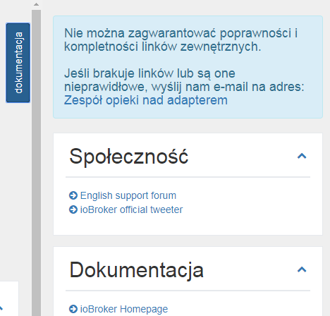
Zebraliśmy listę ważnych linków. Możesz to znaleźć na liście rozwijanej, klikając przycisk w prawym górnym rogu „Dokumentacja”. Jeśli przycisk nie jest widoczny, upewnij się, że odpowiedni element w konfiguracji jest zaznaczony.

Poszczególne linki są przechowywane w różnych kategoriach: Społeczność, Dokumentacja, Wiadomości, Blog, Lista odtwarzania wideo, Rozwój i Inne

Dla poprawności i kompletności linków zewnętrznych nie można udzielić gwarancji. Jeśli brakuje linków lub są one nieprawidłowe, wyślij nam e-mail.

## Aktualizacje

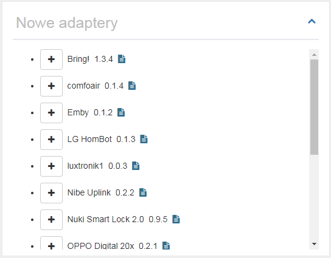
Jeśli nowe wersje adaptera zostaną wydane, a Ty również je zainstalujesz, pojawi się na tej liście.

Stąd możesz bezpośrednio aktualizować za pomocą kliknięcia .
Po najechaniu myszką  zobaczysz najważniejsze zmiany od czasu wydania.
Kliknij , aby wyświetlić pełny opis adaptera.

Jeśli host - tj. JS-Controller - jest przestarzały, poniżej „Nowe adaptery” pojawi się dodatkowe pole z komunikatem, że należy zaktualizować hosta.

## Nowe adaptery

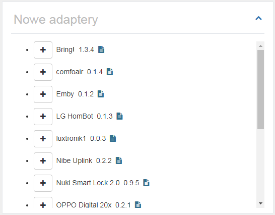
Tutaj wyświetlane są wszystkie nowe i oficjalnie wydane adaptery z ostatnich 60 dni.

Stąd możesz bezpośrednio zainstalować nowy adapter, klikając .
Kliknij , aby wyświetlić pełny opis adaptera.

<br>

## Informacje o systemie

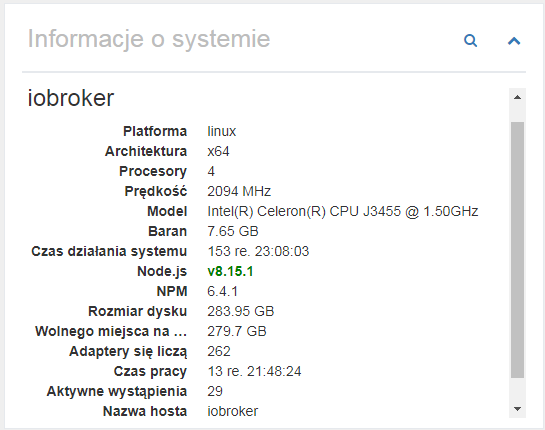
Tutaj wyświetlane są informacje systemowe systemu ioBroker. W przypadku systemów z wieloma hostami wyświetlana jest oczywiście informacja o innych hostach. Dane te pochodzą z kontrolera JS.

Następujące informacje (na hosta) są dostarczane jako informacje:

- System operacyjny (linux, win32, darwin, android, aix, freebsd, openbsd lub sunos)
- Architektura (arm, arm64, ia32, mips, mipsel, ppc, ppc64, s390, s90x, x32 i x64)
- Procesory (liczba rdzeni)
- Prędkość (szybkość procesora)
- Model (model procesora)
- RAM (przybliżona całkowita pamięć)
- Czas działania systemu (jak długo system działa)
- Node.js (wersja Node.js - jeśli jest nowsza lub twoja wersja jest przestarzała, ta informacja również jest tutaj)
- NPM (wersja NPM)
- Rozmiar dysku twardego (rozmiar dysku twardego, na którym znajduje się ioBroker)
- Dysk twardy za darmo (ile miejsca jest jeszcze dostępne)
- liczba adapterów (ile adapterów zostało wydanych do tej pory dla ioBroker)
- Czas pracy (jak długo działa ioBroker bez restartu)
- Aktywne instancje (ile instancji adaptera jest aktualnie uruchomionych na tym hoście)
- nazwa hosta (nazwa hosta)

```
Jeśli brakuje jakiejkolwiek informacji, należy zainstalować najnowszą wersję kontrolera JS.
To jest zestaw danych JS-Controller v1.5.7.
```

Kliknięcie  wyświetla szczegółowe informacje o systemie głównym.

### Informacje o systemie (widok szczegółowy)

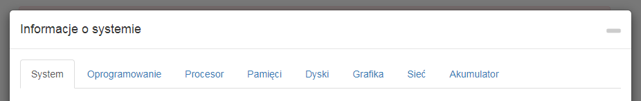

Tutaj wiele informacji o systemie domu jest wyświetlanych i zapisywanych jako obiekt. Mogą one być używane przez ciebie całkiem wygodnie. Większość danych jest odczytywana i zapisywana tylko wtedy, gdy adapter jest ładowany po raz pierwszy, ponieważ nie zmieniają się one tak łatwo.

Niektóre dane są również aktualizowane cyklicznie. Jak często to się zdarza, można ustawić w konfiguracji.

Pamiętaj, że nie wszystkie informacje są dostępne w każdym systemie operacyjnym, co może spowodować, że niektóre informacje nie będą wyświetlane.

#### System

Tutaj wyświetlane są dane sprzętowe - płyta główna, bios, sprawa itp ...

#### Oprogramowanie

Oprogramowanie zawiera dane dotyczące systemu operacyjnego, zainstalowanego oprogramowania, uruchomionych procesów i zalogowanych użytkowników.

#### Centralny procesor

Tutaj znajdziesz dane dotyczące procesora, takie jak prędkość, obciążenie i temperatura.

**Problemy z Windows:** Wmic jest używany do wykrywania temperatury systemu Windows. W niektórych przypadkach wmic musi być uruchamiany z uprawnieniami administratora. Jeśli więc nie otrzymasz żadnych wartości, spróbuj uruchomić je ponownie z odpowiednimi uprawnieniami. Jeśli nadal nie otrzymasz żadnych wartości, system może nie obsługiwać tej funkcji.

**Problemy z Linuksem:** W niektórych przypadkach musisz zainstalować pakiet czujników Linuksa, aby zmierzyć temperaturę, np. na systemach opartych na DEBIAN, uruchamiając:

```
$ sudo apt-get install lm-sensors
```

#### Pamięć główna

Oto wszystkie dane do głównej pamięci, takie jak wolna pamięć lub dane na pasku RAM.

#### Dyski twarde

Wszystkie dane na dyskach twardych, partycjach, raidach i ROMach.

**Problemy z Linuksem:** Aby móc korzystać z S.M.A.R.T. Aby zobaczyć status Linuksa, musisz zainstalować smartmontools. W dystrybucjach Linuksa opartych na DEBIAN można je zainstalować, wykonując następujące czynności:

```
$ sudo apt-get install smartmontools
```

#### Graficzny

Dane o kontrolerze lub monitorze są wyświetlane tutaj, jeśli są dostępne / obsługiwane.

#### Sieć

Wszystkie dane o połączeniach sieciowych.

#### Bateria

Wszystkie dane o baterii, jeśli takie istnieją.

**Problemy z systemem Windows:** Wmic jest używany do wykrywania stanu baterii systemu Windows. W niektórych przypadkach wmic musi być uruchamiany z uprawnieniami administratora. Jeśli więc nie otrzymasz żadnych wartości, spróbuj uruchomić je ponownie z odpowiednimi uprawnieniami. Jeśli nadal nie otrzymasz żadnych wartości, system może nie obsługiwać tej funkcji.

## Żądania adaptera

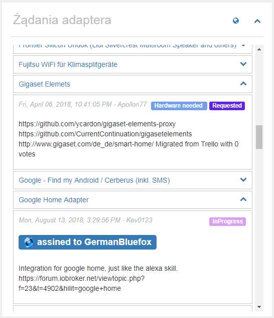
Wszystkie żądania adapterów zostały uwzględnione w github jako problem. Każdy, kto czegoś pragnie, może wprowadzić tutaj swoje życzenie i każdy może się rozwijać, może wybrać problem i opracować z niego adapter.

W tej liście zostanie wyświetlony tytuł, a kliknięcie przycisku  spowoduje wyświetlenie bardziej szczegółowych informacji. Powyżej łączy, gdy życzenie zostało utworzone, popraw bieżący status i poniżej szczegółowego opisu. Jeśli deweloper wybrał żądanie, zostanie ono wymienione tutaj jako „przypisane do”.

Klikając , przychodzisz bezpośrednio do Github i możesz tam dodać własne życzenia.
Jeśli klikniesz tytuł życzenia, wylądujesz bezpośrednio na prośbę Github i możesz głosować na niego. Preferowane są oczywiście życzenia z wieloma głosami.

Panel „Żądania adaptera” może być ukryty w konfiguracji lub wyświetlany w stanie zamkniętym podczas ładowania.

### Utwórz nowe żądanie adaptera

Aby utworzyć nowe żądanie, najpierw potrzebujesz konta Github i musisz określić token w konfiguracji. Aby uzyskać więcej informacji, zobacz [Opis konfiguracji](#Konfiguracja) > „Token osobistego dostępu GitHub”.

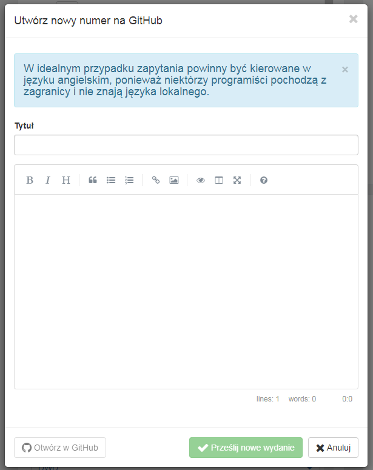
Jeśli klikniesz , pojawi się okno, w którym możesz utworzyć tytuł i opis żądania adaptera.

Jako tytuł zawsze wybieraj wyraźny i krótki termin, taki jak „Panasonic TV”. Następnie opisz swoje życzenia tak dokładnie, jak to możliwe.
Jeśli dla produktu istnieją już znane interfejsy API, należy również napisać to.
Wszelkie informacje, które mogą pomóc deweloperowi zwiększyć prawdopodobieństwo, że odpowiedni adapter zostanie szybko opracowany. Jeśli to możliwe, napisz wszystko po angielsku,
ponieważ niektórzy deweloperzy pochodzą z zagranicy i prawdopodobnie nie mówią w twoim języku.

Klikając „Prześlij nowe wydanie”, zostanie utworzony problem w Github. Teraz możesz kliknąć niebieski przycisk po lewej stronie, aby przejść bezpośrednio do problemu lub po prostu zamknąć okno.

### Głosuj na żądania adaptera

Z kontem Github możesz także głosować bezpośrednio na żądania adaptera, klikając . Jeśli to zadziała, przycisk zmieni kolor na zielony. Każdy może głosować tylko jeden głos. Całkowita liczba głosów jest wyświetlana w obiekcie przed tytułem.

W przeglądzie żądania adaptera, na które głosowałeś, są wyświetlane na zielono, a prośby młodsze niż 1 miesiąc są niebieskie.

## Moje adaptery

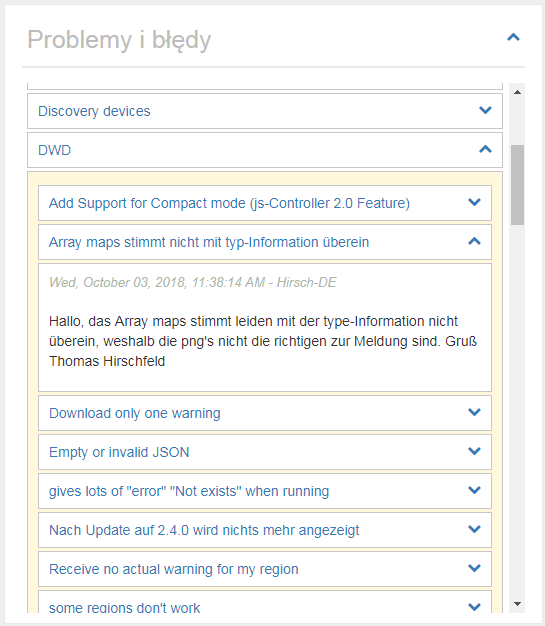
Oczywiście żadne adaptery nie są wolne od błędów, a niektórzy użytkownicy mogą również mieć pomysły na rozszerzenie. Tutaj zebrano wszystko, co wiadomo o zainstalowanych adapterach. Możesz także użyć tej listy, aby dowiedzieć się, czy znaleziony błąd jest również znany deweloperowi, ponieważ naprawione mogą być tylko znane błędy.

Kliknij , po prawej stronie nazwy adaptera otworzy listę znanych problemów / żądań. Można je również otworzyć, gdzie znajdziesz szczegółowy opis.

Jeśli klikniesz nazwę adaptera, możesz przejść bezpośrednio do listy problemów w Github i ewentualnie wprowadzić nowy błąd lub chcesz rozwinąć.
Jeśli klikniesz tytuł problemu, trafisz bezpośrednio na wiadomość na Github i możesz opcjonalnie dostarczyć deweloperowi więcej informacji, zostaw jako komentarz.
Klikając , można wyświetlić wszystkie komentarze dotyczące problemu. Przycisk pojawia się tylko wtedy, gdy dostępne są komentarze. Łączna liczba komentarzy jest wyświetlana w dymku przed tytułem problemu.

Panel „Problemy i błędy” może być ukryty w konfiguracji lub wyświetlany w stanie zamkniętym podczas ładowania.

### Zgłoś życzenia lub błędy

Jeśli otworzysz kartę, możesz zgłosić nowy błąd lub zasugerować ulepszenia, klikając 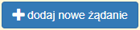. Wymaga to konta Github i tokena w konfiguracji. Dalsze szczegóły można znaleźć w [Opis konfiguracji](#Konfiguracja) > „Token osobistego dostępu GitHub”.

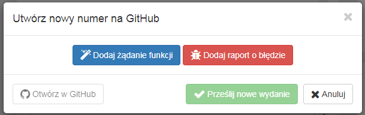
Po kliknięciu otrzymasz możliwość złożenia propozycji ulepszenia (niebieski) lub zgłosić błąd (czerwony). Obie opcje umożliwiają wprowadzenie tytułu i opisu.

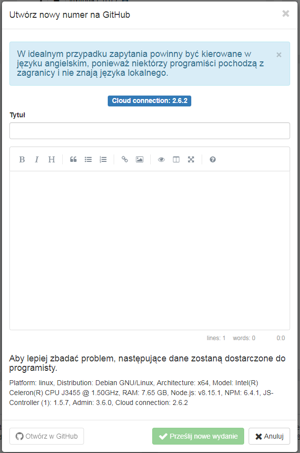
Tytuł powinien dać ci jasny i zwięzły opis problemu. Opisując nie powinieneś być oszczędny z informacją. Każdy szczegół może pomóc deweloperowi w szybszym wdrożeniu problemu lub pożądaniu. Jeśli to możliwe, napisz wszystko po angielsku,
ponieważ niektórzy programiści pochodzą z zagranicy i prawdopodobnie nie mówią w twoim języku.

Klikając „Prześlij nowe wydanie”, zostanie utworzony problem w Github. Teraz możesz kliknąć niebieski przycisk po lewej stronie, aby przejść bezpośrednio do problemu lub po prostu zamknąć okno.

### Oznacz adapter jako ulubiony

Deweloperzy poświęcają wiele wolnego czasu na tworzenie adapterów dla Ciebie. Oto Twoja szansa, pod warunkiem, że wprowadzono Token Guthub, klikając , aby podziękować twórcom za ich pracę. Każdy może głosować tylko jeden głos. Całkowita liczba głosów zostanie wyświetlona w obiekcie przed tytułem.

W przeglądzie zalecane przez Ciebie adaptery są wyświetlane na zielono.

## Adapter ioBroker na Github

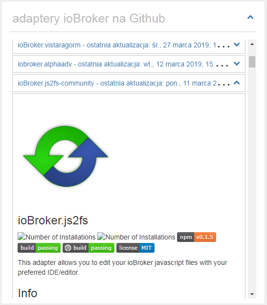
Liczba oficjalnych adapterów dla ioBroker jest już znaczna. Oczywiście w sieci dostępnych jest znacznie więcej adapterów. Są one wyszukiwane i wyświetlane tutaj.

Jeśli otworzysz panel za pomocą kliknięcia , wyświetlony zostanie pełny opis adaptera.

Panel „ioBroker na Github” może być ukryty w konfiguracji lub wyświetlany w stanie zamkniętym podczas ładowania. Możesz również dostosować kolejność sortowania.

```
UWAŻAJ!!! Adaptery te mogą znajdować się na bardzo wczesnym etapie rozwoju.
Nie należy ich instalować w systemie produkcyjnym.
Każda instalacja jest na własne ryzyko!
```

## Aktualności

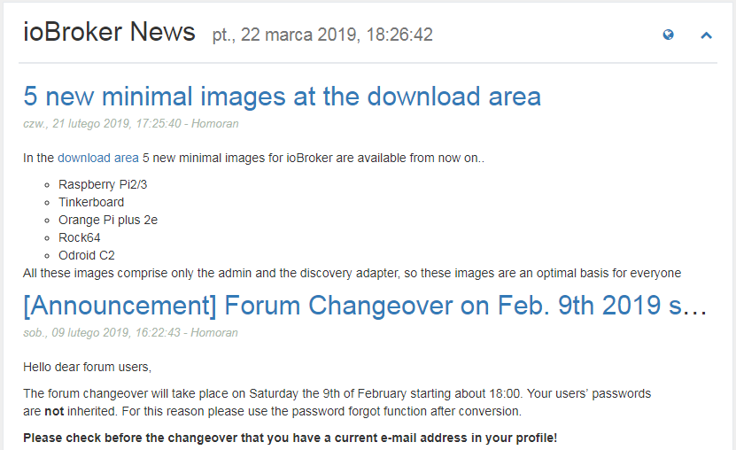
Od czasu do czasu będą publikowane oficjalne wiadomości z zespołu ioBroker. Tutaj zostaną wyświetlone.

Kliknij , aby przejść bezpośrednio do oficjalnej strony ioBroker.

Wiadomości są wyświetlane bez żadnych problemów podczas uzyskiwania dostępu do ioBroker przez IP lub localhost: 8081. Ale jeśli używasz nazwy hosta takiej jak meinhaus.de:8081, musisz uzyskać bezpłatny klucz API w Feednami. Aby się zarejestrować, kliknij [tutaj](https://toolkit.sekando.com/docs/en/setup/hostnames) i postępuj zgodnie z instrukcjami.

## Forum

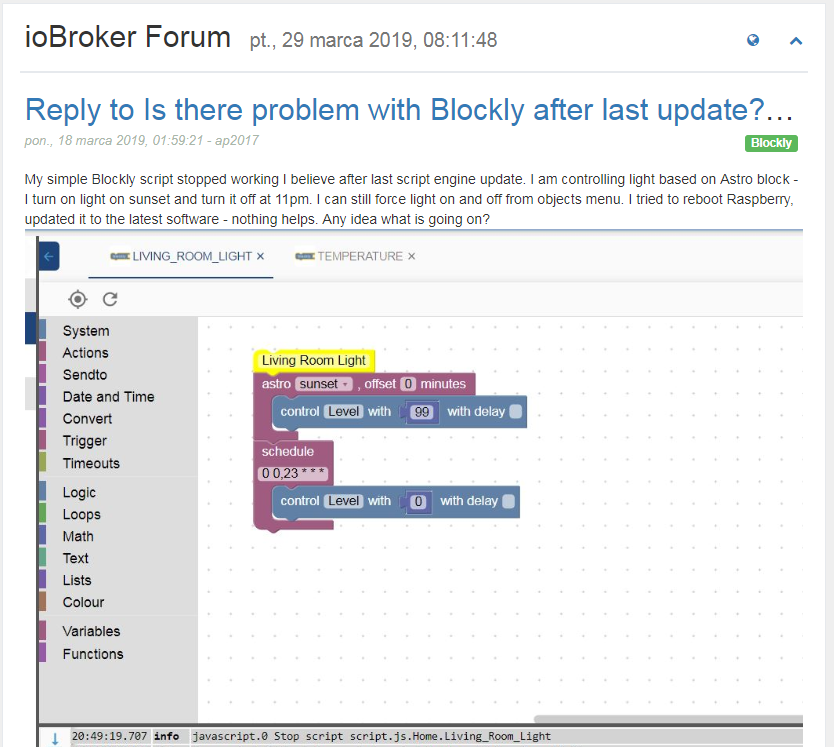
Tutaj najnowsze wpisy na forum są wyświetlane w wybranym języku. Jeśli nie ma forum w języku, dane będą wyświetlane na forum angielskim.

Kliknij , aby przejść bezpośrednio na forum.

Wpisy na forum będą wyświetlane bez problemów podczas uzyskiwania dostępu do ioBroker przez IP lub localhost: 8081. Ale jeśli używasz nazwy hosta takiej jak meinhaus.de:8081, musisz uzyskać bezpłatny klucz API w Feednami. Aby się zarejestrować, kliknij [tutaj](https://toolkit.sekando.com/docs/en/setup/hostnames) i postępuj zgodnie z instrukcjami.