# Admin

O Info Adapter foi desenvolvido para fornecer várias informações sobre o sistema, sobre o ioBroker e tópicos relevantes para o usuário. O usuário deve obter uma visão geral de todos os dados interessantes e importantes, e a equipe do ioBroker terá a oportunidade de entrar em contato com o usuário ainda mais rapidamente, se houver informações importantes disponíveis.

# Instalação

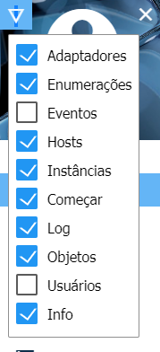
Para ver a janela de informações na guia Guia, você deve primeiro verificar como Visível no Admin após a instalação. Para fazer isso, clique no triângulo à esquerda no canto superior esquerdo da janela Admin e selecione "Info" no menu.

# Configuração

<p align="center">
    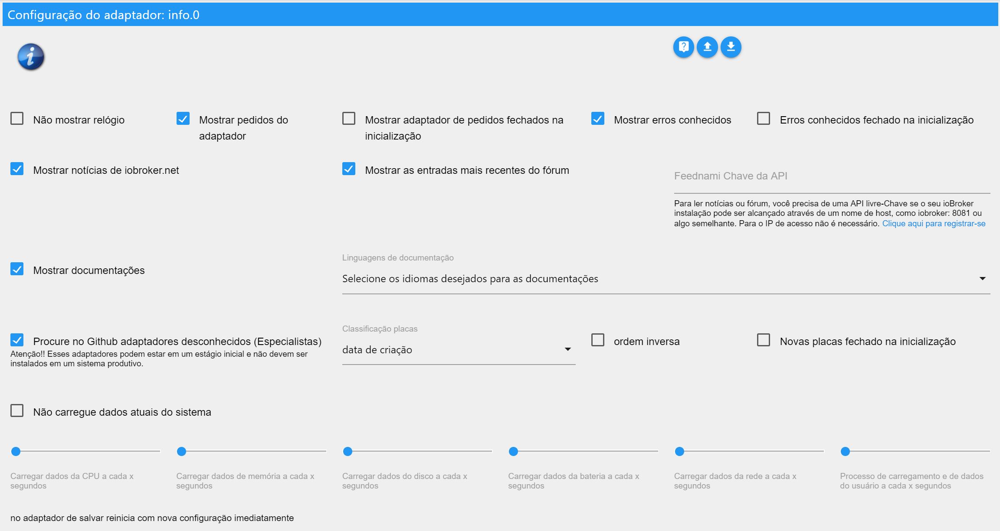
</p>

* **Não mostrar relógio** - Para ocultar o relógio no canto superior esquerdo.
* **Não mostrar os eventos (somente alemão)** - O calendário de eventos não é exibido
* **Mostrar solicitações do adaptador** - Exibe o painel com as solicitações do adaptador.
    * **Solicitações de adaptador fechadas na inicialização** - O painel com as solicitações do adaptador é fechado quando a janela Informações é iniciada.
* **Exibir erros conhecidos** - Exibe o painel com erros conhecidos e solicitações de adaptadores instalados.
    * **Erros conhecidos na inicialização fechados** - O painel com os erros conhecidos é fechado ao iniciar a janela de informações.

* **Show News from iobroker.net** - Exibe o painel com as notícias oficiais do ioBroker.
* **Mostrar as entradas mais recentes do fórum** - Exibe o painel com as últimas entradas do fórum.
* **Feednami API Key** - Se você chamar o ioBroker usando um nome de host, como o iobroker:8081 ou algo assim, você precisa se cadastrar gratuitamente no Feednami para obter uma chave de API apropriada. Isso não é necessário para o acesso por meio de um endereço IP.

* **Mostrar documentação** - Exibe o botão da documentação.
    * **Selecione os idiomas necessários para a documentação** - Seleção dos idiomas a serem incluídos na documentação. (Você pode ter que clicar no nome à direita para selecionar what - default -> set language + inglês)

* **Search Github for Unknown Adapters (Experts)** - Exibe o painel procurando por adaptadores não aprovados no github.
    * **Sort Adapter by** - Ordena o resultado da pesquisa por nome, data de criação ou última atualização.
    * **ordem inversa** - inverte a ordem dos resultados.
    * **Novos adaptadores fechados na inicialização** - O painel com os adaptadores desconhecidos é fechado ao iniciar a janela de informações.

* **Token de acesso pessoal do GitHub** - Para poder criar novos problemas ou solicitações de adaptadores no Github diretamente do ioBroker, você precisa de um token que possa ser gerado lá. Isso requer uma conta do Github.
Para obter o token, faça o login no Github, clique no ícone do usuário no canto superior direito, vá para "Settings", depois "Developer settings"> "Personal access tokens". Lá, clique em "Generate new token", digite qualquer nome em "Token description" e selecione "Scope", "repo". Então você obtém um token e o insere no ioBroker. Você pode encontrar instruções mais detalhadas em inglês [aqui](https://help.github.com/en/articles/creating-a-personal-access-token-for-the-command-line).
 

* **Não carrega dados atuais do sistema** - Os dados atuais do sistema não são carregados ciclicamente.
    * **Carregar dados da CPU a cada x segundos** - Os dados da CPU são carregados ciclicamente a cada 1 a 10 segundos. (0 está desativado - padrão 3)
    * **Carregar dados de memória a cada x segundos** - Os dados da memória são carregados ciclicamente a cada 1 a 10 segundos. (0 está desativado - padrão 3)
    * **Carregar dados do disco a cada x segundos** - Os dados do disco rígido são carregados ciclicamente a cada 1 a 10 segundos. (0 está desativado - padrão 8)
    * **Carregue os dados da bateria a cada x segundos** - Carregue os dados da bateria ciclicamente a cada 1 a 10 segundos. (0 está desativado - padrão 8)
    * **Carregue os dados da rede a cada x segundos** - Carregue os dados da rede ciclicamente a cada 1 a 10 segundos. (0 está desativado - padrão 3)
    * **Carregar dados do processo e do usuário a cada x segundos** - Os dados do processo e do usuário são carregados ciclicamente a cada 1 a 10 segundos. (0 está desativado - padrão 8)

Com o sistema Windows, o carregamento cíclico dos dados do sistema não deve acontecer muito rápido, porque isso causa uma carga considerável no sistema. Os valores padrão foram selecionados para serem executados sem problemas na maioria dos sistemas.

# Guia de informações

A guia Informações contém várias informações sobre o seu sistema e o ioBroker. A guia é dividida em diferentes blocos que podem ser personalizados. Quase todos os blocos podem ser abertos ou abertos com um clique .

## Relógio

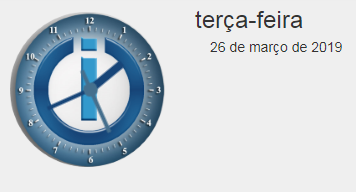
O relógio não tem função especial (mas fiz um esforço) e pode ser desligado a qualquer momento na configuração.

## Barra do Github

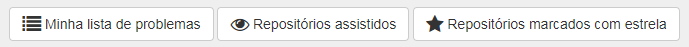
Para ver essa barra, primeiro você precisa de uma conta do Github e deve especificar um token na configuração. Para mais informações, consulte em [Descrição do Configuração](#Configuração) > "Token do GitHub Personal Access".

No momento, você tem a possibilidade de ver problemas e repositórios criados por si mesmo e que são observados ou marcados com uma estrela.

Ao clicar em , todos os comentários sobre o problema podem ser exibidos. O botão só aparece se houver comentários disponíveis. O número total de comentários é mostrado no balão antes do título do problema.

## Messages

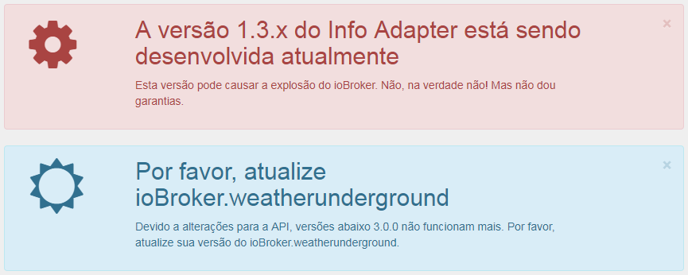
Para enviar rapidamente mensagens importantes relativas ao ioBroker para o usuário, a possibilidade foi criada para criar mensagens. Essas mensagens aparecem APENAS se certas condições se aplicarem. Portanto, nenhuma mensagem é exibida sobre um adaptador, se ele não estiver instalado. Isso garante que SOMENTE os usuários sejam avisados, que também são afetados pelo problema.

As mensagens podem ser fechadas com um clique, no canto superior direito de , mas elas aparecem novamente assim que a guia de informações é recarregada, contanto que o problema persista.

Para o uso de mensagens com outros adaptadores como Javascript, Telegrama, Alexa, etc., eles já são filtrados no objeto "newsfeed_filtered", armazenados como um array de objetos.

Exemplo:
```javascript
const messages = JSON.parse(getState('info.0.newsfeed_filtered').val);
messages.forEach(message => {
    const title = message.title;
    const text = message.content;
    const created = new Date(message.created);
    console.log(created + " " + title + " " + text);
});
```

### Messages (VIS-Widget)


Para as mensagens, foi criado um widget VIS, que também aparece apenas se as mensagens forem do usuário. Se não houver mensagens, nada será exibido, portanto, você não precisa de espaço extra na superfície VIS para as mensagens, mas simplesmente isso. no meio da tela.

## Documentation

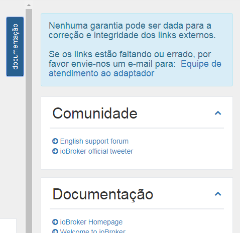
Reunimos uma lista de links importantes. Você pode encontrá-lo como uma lista suspensa clicando no botão no canto superior direito "Documentação". Se o botão não estiver visível, verifique se o item correspondente na configuração está marcado.

Os links individuais são armazenados em diferentes categorias: Comunidade, Documentação, Notícias, Blog, Playlist de Vídeo, Desenvolvimento e Outros.

Para a correção e integridade dos links externos, nenhuma garantia pode ser dada. Se os links estiverem faltando ou incorretos, envie-nos um e-mail.

## Atualizações


Se novas versões de um adaptador forem lançadas e você também o tiver instalado, ele aparecerá nesta lista.

A partir daqui você pode atualizar diretamente com um clique .
Quando você passar o mouse sobre , você verá as mudanças mais importantes desde o seu lançamento.
Clique em  para exibir a descrição completa do adaptador.

Se o host - ou seja, o JS-Controller - estiver desatualizado, uma caixa extra aparecerá abaixo de "Novos adaptadores" com a mensagem de que você deve atualizar o host.

## Novos adaptadores

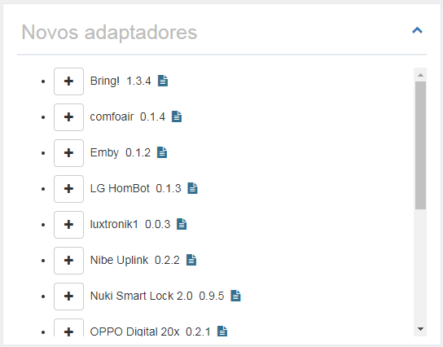
Aqui todos os adaptadores novos e oficialmente liberados dos últimos 60 dias são exibidos.

A partir daqui você pode instalar diretamente o novo adaptador clicando em .
Clique em  para exibir a descrição completa do adaptador.

<br>

## Informação do sistema

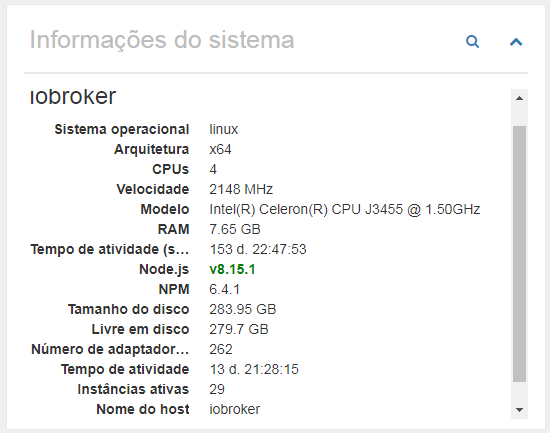
As informações do sistema do sistema ioBroker são exibidas aqui. No caso de sistemas multi-host, é claro, as informações dos outros hosts também são exibidas. Esses dados vêm do JS-Controller.

As seguintes informações (por host) são fornecidas como informações:

- Sistema operacional (linux, win32, darwin, android, aix, freebsd, openbsd ou sunos)
- Arquitetura (arm, arm64, ia32, mips, mipsel, ppc, ppc64, s390, s90x, x32 e x64)
- CPUs (número de núcleos)
- Velocidade (velocidade do processador)
- Modelo (modelo do processador)
- RAM (memória total aproximada)
- Tempo de operação do sistema (há quanto tempo o sistema está em execução)
- Node.js (A versão do Node.js - se é mais recente ou a sua versão está desatualizada, esta informação também está aqui)
- NPM (versão NPM)
- Tamanho do disco rígido (tamanho do disco rígido onde o ioBroker está localizado)
- Disco rígido livre (quanto espaço ainda está disponível)
- número de adaptadores (quantos adaptadores foram lançados para o ioBroker até agora)
- Tempo de operação (quanto tempo o ioBroker roda sem reiniciar)?
- Instâncias ativas (quantas instâncias do adaptador estão atualmente em execução neste host)
- nome do host (nome do host)

```
Se alguma informação estiver faltando, uma versão recente do JS-Controller deverá ser instalada.
Este é o conjunto de dados do JS-Controller v1.5.7.
```

Clicar em  exibe informações detalhadas sobre o sistema principal.

### Informações do sistema (visão detalhada)

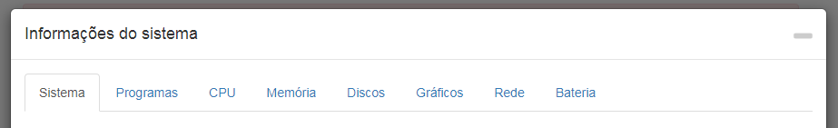

Aqui, muitas informações sobre o sistema da casa são exibidas e armazenadas como um objeto. Estes podem então ser usados ​​por você confortavelmente. A maioria dos dados é somente lida e salva quando o adaptador é carregado pela primeira vez, já que eles não são alterados tão facilmente.

Alguns dados também são atualizados ciclicamente. Quantas vezes isso acontece pode ser definido na configuração.

Tenha em mente que nem todas as informações estão disponíveis em todos os sistemas operacionais, o que pode resultar em algumas informações não sendo exibidas.

#### Sistema

Aqui os dados do hardware são exibidos - motherboard, bios, case etc ...

#### Programas

O software inclui dados sobre o sistema operacional, software instalado, processos em execução e usuários conectados.

#### Processador central

Aqui você pode encontrar dados sobre a CPU, como velocidade, carga e temperatura.

**Problemas com o Windows:** wmic é usado para detectar a temperatura de um sistema Windows. Em alguns casos, o wmic precisa ser executado com privilégios de administrador. Portanto, se você não obtiver nenhum valor, tente executá-lo novamente com as permissões apropriadas. Se você ainda não obtiver nenhum valor, seu sistema pode não suportar esse recurso.

**Problemas com o Linux:** Em alguns casos, você precisa instalar o pacote do sensor Linux para medir a temperatura, por exemplo, em sistemas baseados em DEBIAN executando:

```
$ sudo apt-get install lm-sensors
```

#### Memória principal

Aqui estão todos os dados para a memória principal, como memória livre ou dados para a barra de RAM.

#### Discos rígidos

Todos os dados em discos rígidos, partições, invasões e ROMs.

**Problemas com o Linux:** Para poder usar o S.M.A.R.T. Para ver o status do Linux, você precisa instalar o smartmontools. Em distribuições Linux baseadas em DEBIAN, você pode instalá-lo fazendo o seguinte:

```
$ sudo apt-get install smartmontools
```

#### Graphic

Os dados sobre o controlador ou monitor são exibidos aqui, se disponíveis / suportados.

#### Network

Todos os dados sobre as conexões de rede.

#### Battery

Todos os dados sobre a bateria, se houver.

**Problemas com o Windows:** O wmic é usado para detectar o status da bateria de um sistema Windows. Em alguns casos, o wmic precisa ser executado com privilégios de administrador. Portanto, se você não obtiver nenhum valor, tente executá-lo novamente com as permissões apropriadas. Se você ainda não obtiver nenhum valor, seu sistema pode não suportar esse recurso.

## Solicitações de adaptadores

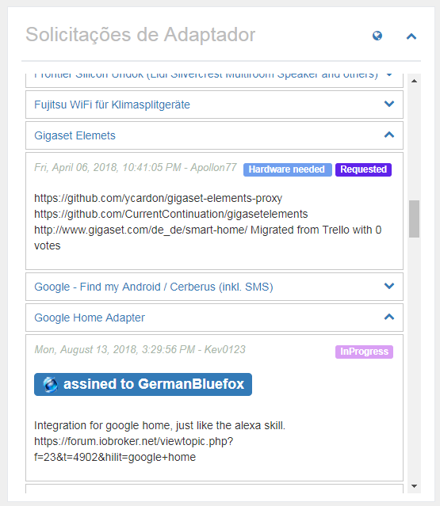
Todas as solicitações do adaptador foram incluídas no github como um problema. Qualquer um que deseje algo, pode inserir seu desejo aqui e qualquer um pode desenvolver, pode então escolher um problema e desenvolver um adaptador a partir dele.

Nesta listagem, um título será exibido e clicando em , informações mais detalhadas ficarão visíveis. Acima links quando o desejo foi criado, certo o status atual e abaixo uma descrição detalhada. Se um desenvolvedor tiver escolhido a solicitação, ela será listada aqui como "definida para".

Ao clicar em , você vem diretamente para o Github e pode adicionar seus próprios desejos lá.
Se você clicar no título de um desejo, você pode entrar diretamente no pedido do Github e pode votar nele. Desejos com muitos votos são obviamente preferidos.

O painel "Solicitações do adaptador" pode estar oculto na configuração ou exibido no estado fechado durante o carregamento.

### Criar novo pedido de adaptador

Para criar uma nova solicitação, primeiro você precisa de uma conta do Github e deve especificar um token na configuração. Para mais informações, consulte em [Descrição do Configuração](#Configuração) > "Token do GitHub Personal Access".

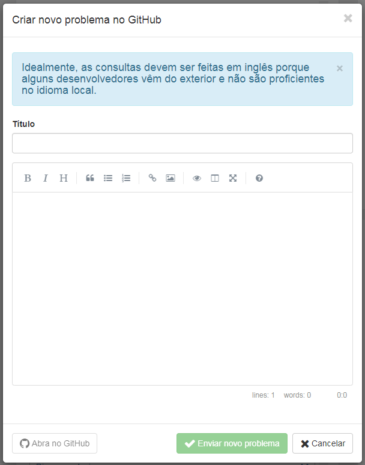
Se você clicar em , aparecerá uma janela onde você terá a possibilidade de criar um título e uma descrição da solicitação do adaptador.

Como título, selecione sempre um claro e curto prazo como "Panasonic TV". Em seguida, descreva seus desejos com a maior precisão possível.
Se já existem APIs conhecidas para o produto, você também deve escrever isso.
Qualquer informação que possa ajudar o desenvolvedor aumenta a probabilidade de que o adaptador correspondente seja desenvolvido rapidamente. Se possível, por favor escreva tudo em inglês,
porque alguns desenvolvedores vêm do exterior e provavelmente não falam seu idioma.

Ao clicar em "Enviar novo problema", um problema será criado no Github. Agora você pode clicar no botão azul à esquerda para ir diretamente para o problema ou apenas fechar a janela.

### Votar nas solicitações do adaptador

Com uma conta do Github, você também pode votar diretamente nas solicitações do adaptador clicando em . Se funcionar, o botão fica verde. Todos podem votar apenas um voto. O número total de vozes é exibido no objeto na frente do título.

Na visão geral, os pedidos de adaptador votados são exibidos em verde e os pedidos menores que 1 mês são azuis.

## Meus adaptadores

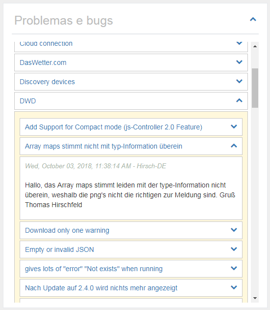
Naturalmente, nenhum adaptador é livre de erros e alguns usuários também podem ter ideias de expansão. Tudo o que é conhecido sobre os adaptadores instalados é coletado aqui. Você também pode usar essa lista para descobrir se um bug que você acabou de encontrar também é conhecido pelo desenvolvedor, porque somente erros conhecidos podem ser corrigidos.

Clique em , à direita do nome do adaptador, será aberta a lista de problemas / solicitações conhecidos. Estes também podem ser abertos, onde você encontrará uma descrição detalhada.

Se você clicar no nome do adaptador, poderá ir diretamente para a lista de problemas no Github e possivelmente inserir um novo erro ou desejar expandir.
Se você clicar no título de um problema, acabará diretamente com a mensagem no Github e poderá fornecer ao desenvolvedor mais informações, deixe como comentário.
Ao clicar em , todos os comentários sobre o problema podem ser exibidos. O botão só aparece se houver comentários disponíveis. O número total de comentários é mostrado no balão antes do título do problema.

O painel "Problemas e erros" pode estar oculto na configuração ou exibido no estado fechado durante o carregamento.

### Comunicar desejos ou erros

Se você abrir um adaptador, terá a opção de relatar um novo erro ou fazer sugestões de melhorias clicando em 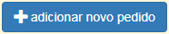. Isso requer uma conta do Github e um token na configuração. Mais detalhes podem ser encontrados em [Descrição da configuração](#Configuração) > "Token do GitHub Personal Access".

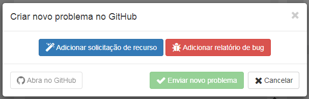
Ao clicar, você terá a oportunidade de fazer uma proposta de melhoria (azul) ou relatar um bug (vermelho). Ambas as opções permitem inserir um título e uma descrição.


O título deve fornecer uma descrição clara e concisa do problema. Ao descrever, você não deve ser frugal com informações. Cada detalhe pode ajudar o desenvolvedor a implementar o problema ou o desejo mais rapidamente. Se possível, por favor escreva tudo em inglês,
porque alguns desenvolvedores vêm do exterior e provavelmente não falam sua língua.

Ao clicar em "Enviar novo problema", um problema será criado no Github. Agora você pode clicar no botão azul à esquerda para ir diretamente para o problema ou apenas fechar a janela.

### Marcar adaptador como favorito

Os desenvolvedores sacrificam muito tempo livre para desenvolver adaptadores para você. Aqui está sua chance, desde que um Token Guthub tenha sido inserido, clicando em  para agradecer aos desenvolvedores pelo seu trabalho. Todos podem votar apenas um voto. O número total de votos será mostrado no objeto antes do título.

Na visão geral, os adaptadores que foram favorecidos por você são exibidos em verde.

## Adaptador ioBroker no Github


O número de adaptadores oficiais para o ioBroker já é considerável. Claro, existem muitos mais adaptadores disponíveis na rede. Estes são pesquisados ​​e exibidos aqui.

Se você abrir o painel com um clique , a descrição completa do adaptador será exibida aqui.

O painel "Adaptador ioBroker no Github" pode estar oculto na configuração ou exibido no estado fechado durante o carregamento. Você também pode ajustar a ordem de classificação.

```
CUIDADO!!! Esses adaptadores podem estar em um estágio muito inicial de desenvolvimento.
Estes não devem ser instalados em um sistema de produção.
Cada instalação é por sua conta e risco!
```

## Notícia

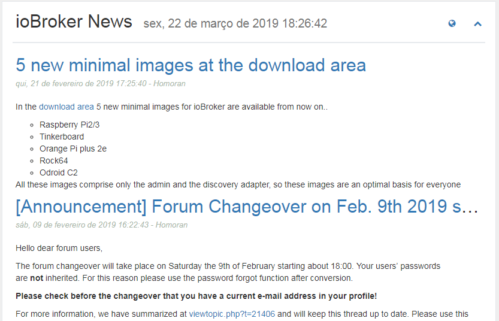
De vez em quando, as notícias oficiais da equipe do ioBroker serão publicadas. Aqui eles serão exibidos.

Clique em  para ir diretamente para a página oficial do ioBroker.

A notícia é exibida sem problemas ao acessar o ioBroker via IP ou localhost:8081. Mas se você usar um nome de host como meinhaus.de:8081, você precisa obter uma chave de API gratuita na Feednami. Para se registrar, clique [aqui](https://toolkit.sekando.com/docs/en/setup/hostnames) e siga as instruções.

## Fórum

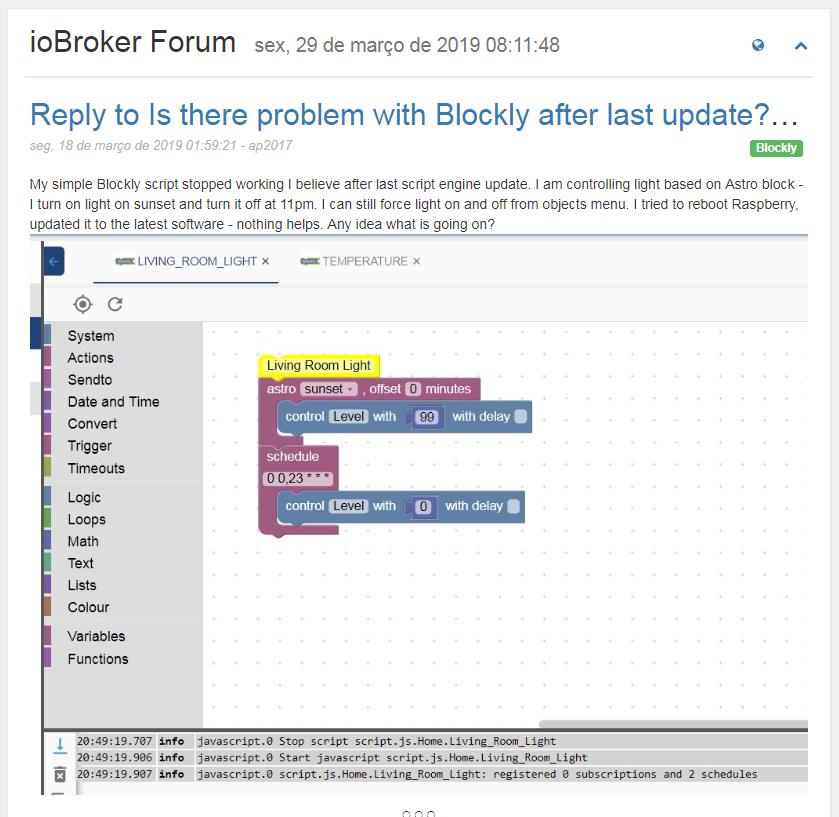
Aqui, as entradas mais recentes do fórum são exibidas no idioma selecionado. Se não houver fórum no idioma, os dados serão exibidos no fórum em inglês.

Clique em  para ir diretamente ao fórum.

As entradas do fórum serão exibidas sem problemas ao acessar o ioBroker via IP ou localhost:8081. Mas se você usar um nome de host como meinhaus.de:8081, você precisa obter uma chave de API gratuita na Feednami. Para se registrar, clique [aqui](https://toolkit.sekando.com/docs/en/setup/hostnames) e siga as instruções.