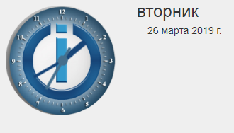

# Admin

Информационный адаптер был разработан для предоставления пользователю различной информации о системе, ioBroker и соответствующих темах. Пользователь должен получить обзор всех интересных и важных данных, и команда ioBroker получит возможность связаться с пользователем еще быстрее, если будет доступна важная информация.

# Установка

Чтобы увидеть информационное окно на вкладке «Вкладка», необходимо сначала установить его как «Видимый» в Admin после установки. Для этого нажмите на левый треугольник в верхнем левом углу окна администратора и выберите «Информация» в меню.

# Конфигурация

* Не показывать часы - чтобы скрыть часы в левом верхнем углу.
* Показать запросы адаптера - отображает панель с запросами адаптера.
    * Запросы адаптера закрываются при запуске - Панель с запросами адаптера закрывается при запуске информационного окна.
* Просмотр известных ошибок - отображает панель с известными ошибками и запросами на установленные адаптеры.
    * Известные ошибки при запуске закрыты - Панель с известными ошибками закрывается при запуске информационного окна.

* Показать новости от iobroker.net - Отображает панель с официальными новостями ioBroker.
* Показать последние записи форума - Отображает панель с последними записями форума.
* Feednami API Key - если вы вызываете ioBroker, используя имя хоста, например iobroker: 8081 или что-то в этом роде, вам нужно бесплатно зарегистрироваться в Feednami, чтобы получить соответствующий ключ API. Это не обязательно для доступа через IP-адрес.

* Показать документацию - отображает кнопку для документации.
    * Выберите требуемые языки для документации - Выбор языков, которые будут включены в документацию.

* Поиск Github для неизвестных адаптеров (Эксперты) - отображает панель поиска неутвержденных адаптеров в Github.
    * Sort Adapter by - сортирует результаты поиска по имени, дате создания или последнему обновлению.
    * обратный порядок - меняет порядок результатов.
    * Новые адаптеры закрыты при запуске - Панель с неизвестными адаптерами закрывается при запуске информационного окна.

* Не загружать текущие системные данные - текущие системные данные не загружаются циклически.
    * Загрузка данных ЦП каждые х секунд - данные ЦП циклически загружаются каждые 2–10 секунд. 0 выключен.
    * Загружать данные памяти каждые x секунд - данные памяти загружаются циклически каждые 2-10 секунд. 0 выключен.
    * Загрузка данных на жестком диске каждые x секунд. Данные памяти загружаются циклически каждые 2–10 секунд. 0 выключен.

# Информация вкладка

## часы

## сообщения

## документация

## обновления

## Новые адаптеры

## Системная информация

## Запросы адаптера

## проблемы и ошибки

## Адаптер ioBroker на Github

## новости

## форум